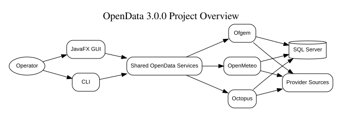

# OpenData

OpenData is a Java 17 command-line framework for acquiring data from external
sources, transforming it into validated records and loading it into Microsoft
SQL Server. Data-source integrations are implemented as plugins within a
modular monolith.



## Version 2.0.0

The current code and documentation baseline is **OpenData 2.0.0**. Version 2.0.0
moves application and plugin configuration into SQL Server, adds database-backed
plugin registration, protects the bootstrap database password with an X.509/PKCS#12
certificate pair, standardises the plugin lifecycle, and completes local PDF
statement ingestion for the Octopus Energy plugin.

Version 2.0.0 is the active development and release-candidate baseline. A tagged
release should be published only after the checks in the
[final release checklist](docs/release/Final-Release-Checklist.md) have passed.

See the [2.0.0 release notes](RELEASE_NOTES.md),
[release record](docs/release/Release-2.0.0.md), and
[1.x upgrade guide](docs/migration/version-1-to-version-2.md).

## Capabilities

- Register application and plugin configuration in SQL Server with `--register`.
- Retain only the database URL, username, encrypted password and bootstrap mode
  in `application.properties` after registration.
- Select one plugin, several plugins, or all enabled plugins.
- Execute selected plugins concurrently with bounded parallelism.
- Perform side-effect-free dry runs without database writes or run-audit rows.
- Process Ofgem Energy Price Cap workbooks.
- Download and persist Open-Meteo historical daily weather data.
- Discover local Octopus Energy statement PDFs, exclude completed files by
  filename and SHA-256, transform all new statements as a batch, load gas and
  electricity records transactionally, and archive successfully processed files.
- Generate technical, administrator, developer and API-reference documents from
  Markdown, PlantUML and manifest definitions.

## Standard plugin lifecycle

Every plugin follows the same top-level flow:

```text
Initialise -> Extract -> Transform -> Load -> Finalise
```

`Initialise` controls the plugin-specific flow. `Extract` obtains source data and
passes it to `Transform`. `Transform` creates validated records for `Load`.
`Finalise` runs after processing to perform cleanup and final reporting. Plugins
use the shared exception framework rather than declaring plugin-local exception
hierarchies.

## Installed plugins

| Plugin ID | Source | Version 2.0.0 behaviour |
|---|---|---|
| `ofgem` | Ofgem public Energy Price Cap publication | Discovers, downloads, transforms and loads the current workbook |
| `openmeteo` | Open-Meteo Historical Weather API | Downloads, validates and persists configured daily weather history |
| `octopus` | User-supplied Octopus Energy PDF statements | Scans `C:\Attachments\octopus` by default, prevents duplicate processing, batch transforms, loads and archives statements |

The Octopus plugin processes files already obtained by the user. It does not log
in to, scrape, or download statements from the Octopus Energy website.

## Requirements

- Java Development Kit 17 or later, compiling with Java 17 compatibility.
- Maven 3.9 or later.
- Microsoft SQL Server for registration and write-mode runs.
- PowerShell 5.1 or later for the supplied Windows scripts.
- Pandoc and PlantUML only when rebuilding generated manuals and diagrams.

## Build

```powershell
git clone https://github.com/TerryCurranZellis/OpenData.git
Set-Location OpenData
mvn clean verify
mvn package
```

The Maven build currently produces `target/opendata-2.0.0.jar` without bundled
runtime dependencies or a `Main-Class` manifest entry. Run
`com.towermarsh.opendata.OpenData` from Apache NetBeans or another classpath-aware
launcher. Do not rely on `java -jar target/opendata-2.0.0.jar` until executable
packaging is explicitly added and verified.

## Database bootstrap and registration

Install the SQL scripts in numeric order, create the configuration certificate,
and start with a minimal bootstrap file:

```properties
application.version=2.0.0
application.use-database-properties=false
database.url=jdbc:sqlserver://localhost;databaseName=OpenData;encrypt=true;trustServerCertificate=true
database.user=OpenData
database.password=<initial-plain-text-password>
```

Register the classpath application and plugin properties:

```text
--register
```

Registration stores the runtime and plugin configuration in SQL Server, encrypts
the database password with the public certificate, and rewrites the bootstrap
file with `application.use-database-properties=true`. Subsequent starts decrypt
the bootstrap password with the private key from the PKCS#12 file before loading
runtime configuration from the database.

The supplied development PFX uses `nopassword`. Override it with either:

```text
-Dopendata.config.keystore.password=<pfx-password>
OPENDATA_CONFIG_KEYSTORE_PASSWORD=<pfx-password>
```

Replace the supplied development certificate and password before a production
installation. See the
[database configuration and security guide](docs/guides/database-configuration-and-security.md).

## Command-line examples

```text
--help
--list-plugins
--register
--plugin ofgem --dry-run
--plugin openmeteo
--plugin octopus --dry-run
--plugin all --parallelism 3
--plugin openmeteo,ofgem --file C:\OpenData\run.properties
```

The launcher prefix depends on the IDE or classpath runner. The complete option
set is documented in the
[command-line reference](docs/reference/command-line-reference.md).

## Documentation

| Area | Entry point |
|---|---|
| Quick start | [docs/guides/quick-start.md](docs/guides/quick-start.md) |
| User guide | [docs/user-guide/README.md](docs/user-guide/README.md) |
| Architecture | [docs/architecture/ARCHITECTURE.md](docs/architecture/ARCHITECTURE.md) |
| Plugin documentation | [docs/plugins/README.md](docs/plugins/README.md) |
| Development | [docs/development/README.md](docs/development/README.md) |
| Repository structure | [docs/development/repository-structure.md](docs/development/repository-structure.md) |
| Operations | [docs/operations/README.md](docs/operations/README.md) |
| Reference | [docs/reference/README.md](docs/reference/README.md) |
| ADR register | [docs/decisions/ADR-REGISTER.md](docs/decisions/ADR-REGISTER.md) |
| Documentation framework | [docs/README.md](docs/README.md) |

Build every configured manual with:

```powershell
.\scripts\Build-Documentation.ps1 -Document All -Format All
```

No documentation script changes are required for the Version 2.0.0 content
refresh; document composition remains manifest driven.

## Data sources and privacy

Ofgem and Open-Meteo data remain subject to their provider licences and service
terms. Octopus Energy statements are customer documents and can contain personal,
account, payment and consumption information. Do not commit statements, extracted
records, database backups, logs containing statement content, or live credentials
to source control. See [DATA-SOURCE-NOTICES.md](DATA-SOURCE-NOTICES.md) and
[SECURITY.md](SECURITY.md).

## Contributing and support

Read [CONTRIBUTING.md](CONTRIBUTING.md) before submitting changes. Participation
is governed by [CODE_OF_CONDUCT.md](CODE_OF_CONDUCT.md). Report security issues
privately as described in [SECURITY.md](SECURITY.md); use the GitHub issue tracker
for non-sensitive defects and feature requests.

## Licence

OpenData is licensed under the Apache License, Version 2.0. See
[`LICENSE`](LICENSE), [`NOTICE`](NOTICE), and the
[licensing policy](docs/Licensing-Policy.md). External data and customer documents
are not relicensed under Apache 2.0 merely because OpenData processes them.
