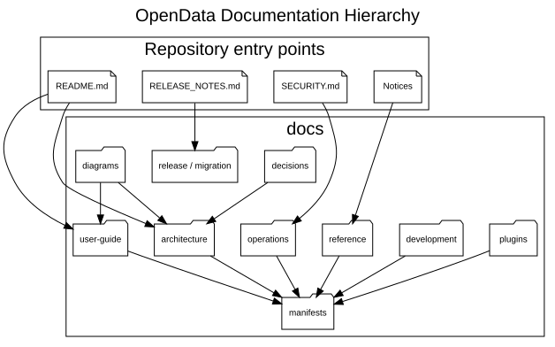

# OpenData Documentation

**Document ID:** DOC-INDEX-001  
**Version:** 2.0  
**Status:** Version 2.0.0 baseline  
**Baseline date:** 2 August 2026  
**Minimum Java version:** 17

---

This directory contains the maintained documentation sources for OpenData
Version 2.0.0. Generated HTML, DOCX and PDF files are build artefacts; Markdown,
PlantUML and manifest files are authoritative.



| Area | Purpose |
|---|---|
| [Quick start](guides/quick-start.md) | Short path from checkout to registration and first dry run |
| [User guide](user-guide/README.md) | Installation, configuration and routine operation |
| [Architecture](architecture/ARCHITECTURE.md) | System boundaries, components, lifecycle and design constraints |
| [Decisions](decisions/ADR-REGISTER.md) | Architecture decision register and individual ADRs |
| [Plugins](plugins/README.md) | Framework and source-specific plugin documentation |
| [Development](development/README.md) | Build, testing, repository structure and release procedures |
| [Operations](operations/README.md) | Logging, monitoring, recovery and administration |
| [Reference](reference/README.md) | CLI, configuration, schema and data-format references |
| [Standards](standards/README.md) | Coding, documentation, testing and security standards |
| [Release](release/Release-2.0.0.md) | Version 2.0.0 release record and checklist |
| [Migration](migration/version-1-to-version-2.md) | Upgrade path from Version 1.x |
| [Diagrams](diagrams/README.md) | Canonical PlantUML sources and rendered SVG inventory |
| [Manifests](manifests/README.md) | Composition of generated manuals |

## Version 2.0.0 documentation principles

- Describe database-backed configuration as the normal post-registration mode.
- Treat `application.properties` as a minimal bootstrap file.
- Use the plugin lifecycle terms `Initialise`, `Extract`, `Transform`, `Load`
  and `Finalise` consistently.
- Describe Octopus as local, user-supplied PDF processing; API extraction is not
  implemented.
- Distinguish public provider data from private customer statement data.
- Keep Version 1.0.0 release material as historical documentation rather than
  silently rewriting it.

## Build and validation

Use the existing scripts; no script changes are required for this documentation
refresh:

```powershell
.\scripts\Validate-Documentation.ps1 -FailOnWarning
.\scripts\Convert-PlantUml.ps1
.\scripts\Build-Documentation.ps1 -Document All -Format All
```

Every generated document is defined by a JSON manifest in `docs/manifests`.
Adding or reordering content should normally require only Markdown and manifest
changes, not PowerShell changes.
