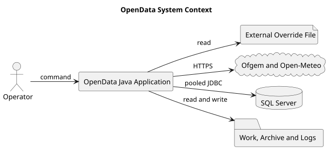

# System Overview

**Document ID:** ARCH-002  
**Version:** 1.1  
**Status:** Baseline  
**Baseline date:** 26 July 2026  
**Minimum Java version:** 17

---

## Boundary

OpenData is a command-line application. It makes outbound HTTPS requests, stores
work/archive/failure artefacts on the file system, and optionally loads accepted
data into SQL Server.

## External participants

| Participant | Interaction |
|---|---|
| Operator | Selects a plugin and supplies overrides |
| Publisher | Provides API, file or HTML page |
| External override file | Supplies application and per-plugin overrides |
| File system | Stores raw and intermediate artefacts |
| SQL Server | Initial relational target |
| Documentation toolchain | Renders PlantUML and publishes Markdown, HTML, DOCX or PDF |

## Capabilities and status

CLI, structured configuration, classpath plugin registration, reflection-based
plugin construction, bounded execution, contextual logging and pooled database
access are implemented. Ofgem and OpenMeteo are executable reference plugins,
and Octopus is registered with a typed transform pipeline but placeholder
extract/load/finalise stages. The reusable ETL interfaces remain contracts
rather than a generic runtime pipeline. Database-backed plugin configuration,
internal scheduling and a production secret provider are not implemented.

## Constraint

Dataset names, URLs and listing text must not be hard-coded in `Main`.

::: {.landscape}
{width=22.5cm}
:::
