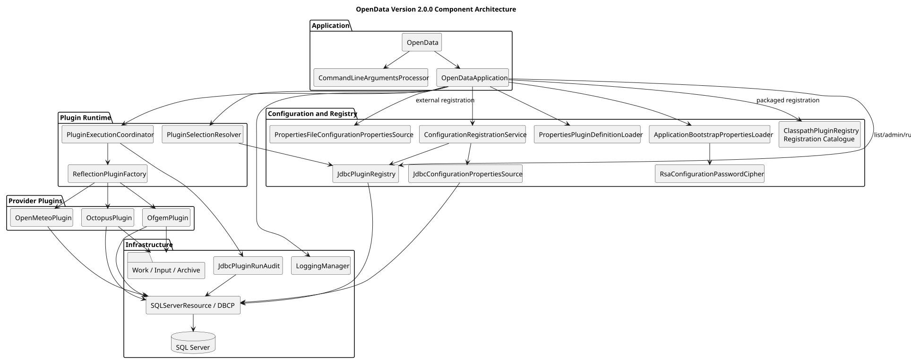

# High-Level Architecture

**Document ID:** ARCH-003  
**Version:** 1.1  
**Status:** Baseline  
**Baseline date:** 26 July 2026  
**Minimum Java version:** 17

---


## Style

OpenData is a modular monolith: one Maven build and JVM process with explicit
package boundaries.

## Components

Application entry point, CLI, runtime configuration, plugin registry, plugin
factory, execution coordinator, plugin implementations, shared acquisition and
parsing services, audit, pooled repositories and logging.

## Control flow

```text
Main -> CLI -> Application -> PluginRegistry -> Configuration
     -> PluginExecutionCoordinator -> OpenDataPlugin
     -> Download/API -> Parse/Transform -> Repository
```

The application layer owns selection, parallelism, database lifecycle and
aggregate status. Each plugin owns its concrete dataset flow and reuses shared
acquisition or parsing components where appropriate. JDBC repositories own SQL
and transaction boundaries.

{width=16cm}
