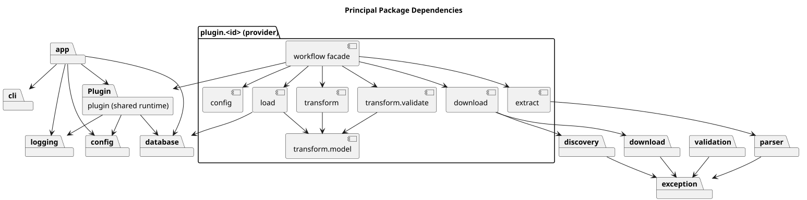

# Package Structure

**Document ID:** ARCH-004  
**Version:** 2.0  
**Status:** Current implementation and target ownership  
**Baseline date:** 3 August 2026  
**Minimum Java version:** 17

---

## Canonical ownership

| Package | Responsibility |
|---|---|
| root / `app` | Entry point, orchestration and run status |
| `cli` | Commons CLI and immutable arguments |
| `config`, `config.model` | Bootstrap, registration, property sources, plugin definitions and immutable records |
| `plugin` | Provider-neutral contracts, registry, factory, coordinator and run audit |
| `plugin.<id>` | Provider workflow facade |
| `plugin.<id>.initialise` | Typed configuration and orchestration |
| `plugin.<id>.extract` | Provider acquisition and source decoding |
| `plugin.<id>.transform`, `.transform.model`, `.transform.validate` | Provider transformation, records and validation |
| `plugin.<id>.load` | Provider SQL, transactions and load metrics |
| `plugin.<id>.finalise` | Archive, cleanup and completion reporting |
| `download`, `download.strategy` | Shared download contracts and implementations |
| `discovery` | Static HTML discovery and link selection |
| `parser` | CSV, JSON and Excel parsers |
| `validation` | Validation contracts and results |
| `etl` | Reusable extract, transform and load contracts |
| `database`, `database.audit` | Connection resources, pooling and ingestion audit repositories |
| `model` | Framework artefact and result values |
| `logging` | JUL setup and task context |
| `exception` | Framework exception hierarchy |
| `ui` | Splash screen, about dialog and application metadata |

## Plugin-local structure

Ofgem, OpenMeteo and Octopus use the same active pipeline boundary:
`initialise -> extract -> transform -> load -> finalise`. The root plugin class
is a small facade that delegates to the initialise/orchestration class.

The uploaded source also contains older compatibility or duplicate classes in
some plugin `config`, `download` and `extract` packages. New documentation and
new development should follow the active classes imported by each
`<Plugin>Initialise` implementation rather than treating every similarly named
class as part of the runtime path.

The canonical command-line model is under `cli`. `ExecutionStatus` is the
application status model. Every public package should retain `package-info.java`.

::: {.landscape}
{width=22.5cm}
:::
