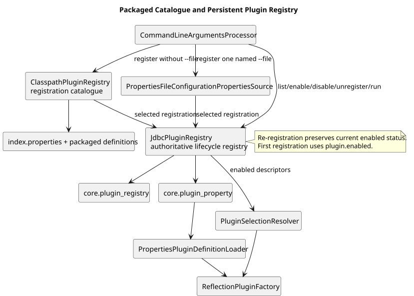

# Plugin Architecture

**Document ID:** ARCH-007  
**Version:** 1.2  
**Status:** Baseline  
**Baseline date:** 26 July 2026  
**Minimum Java version:** 17

---

## Contract

A plugin represents one dataset family and implements
`OpenDataPlugin.execute(PluginExecutionContext)`. Its descriptor provides
identity and implementation class; its immutable definition provides endpoints
and typed properties. The execution context supplies run identity, database
access, clock and dry-run state.

## Phase 1 definition and registry

Each plugin uses `config/plugins/<id>.properties`, parsed into a storage-neutral
`PluginDefinition`. An explicit `index.properties` lists installed ids because
classpath directory scanning is unreliable inside JARs.

`ReflectionPluginFactory` creates the implementation class using a
`PluginDefinition` constructor when present, otherwise a no-argument
constructor. `PluginExecutionCoordinator` creates a fresh instance for each
selected task.

## Rules

Ids are lowercase, stable and unique. Filename, index id and `plugin.id` match.
Disabled plugins may be listed but cannot run. Plugins must be thread-confined,
must honour `context.dryRun()`, must not share JDBC connections and must return
`PluginMetrics`. They do not implement their own CLI or store secrets.

Ofgem is the HTML-to-XLSX reference; OpenMeteo is the parameterised API
reference.

## Provider package boundary

The implementation package is `plugin.<id>`. Its root class is the workflow
facade; source-specific details live in `config`, `download`, `extract`,
`transform`, `transform.model`, `transform.validate` and `load`. This keeps the
shared `plugin` package focused on registry, execution and audit.

The maintained [Java plugin template](../templates/plugin-java/README.md)
contains this structure and a deliberately incomplete transactional loader.

A database registry may later construct the same records from JSON, but that
work is shelved.

{width=16cm}
