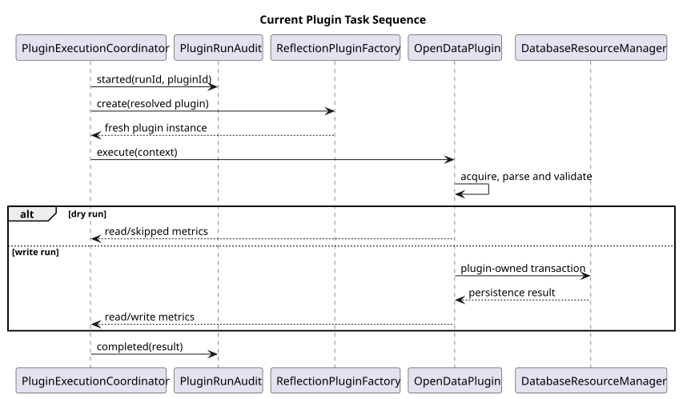

# Pipeline Engine

**Document ID:** ARCH-008  
**Version:** 3.0.0  
**Status:** Implemented coordinator and provider-owned pipelines  
**Baseline date:** 15 August 2026  
**Minimum Java version:** 24

---

## Application sequence

The application-level sequence is:

1. parse and validate command-line arguments;
2. handle help/About or open SQL Server for registry operations;
3. execute register/list/enable/disable/unregister when requested;
4. for a run, load runtime settings and resolve enabled registered plugins;
5. switch to write-mode database access or unavailable dry-run data access;
6. submit one task per plugin to a bounded executor;
7. create audit rows for write runs, execute plugins and aggregate metrics;
8. close the executor, database resource and logging system.

When database-backed configuration is enabled, step 4 opens SQL Server even for
a dry run. The connection is closed before plugin execution and the coordinator
then receives `UnavailableDatabaseResourceManager` with `NoOpPluginRunAudit`.
This prevents plugin persistence but does not make registry/configuration loading
independent of the database. Octopus now skips its processed-file-ledger query
during dry run and therefore respects the same boundary.

## Provider sequence

All three current plugins use an explicit provider-owned sequence for normal
write execution:

1. initialise typed configuration and stage objects;
2. extract or acquire source data;
3. transform and validate typed records;
4. load transactionally, or calculate read/skipped metrics in dry-run mode;
5. finalise by reporting metrics and, where configured, archiving successful
   source files.

Ofgem and OpenMeteo archive or clean up provider work as part of finalisation.
Octopus archives successfully loaded PDF statements only after the database
transaction completes. Its extract, load and finalise stages avoid database and archive side effects
during dry run. A plugin failure stops that task but does not cancel other
selected plugins automatically.

`ExtractService`, `TransformService` and `LoadService` remain reusable contracts.
There is no generic `PipelineEngine` composing them in the active runtime.

::: {.landscape}
{width=22.5cm}
:::
