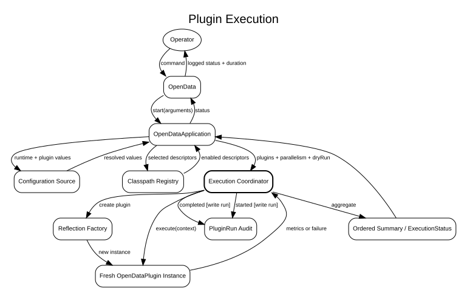

# Component Interactions

**Document ID:** ARCH-010  
**Version:** 1.1  
**Status:** Baseline  
**Baseline date:** 26 July 2026  
**Minimum Java version:** 17

---

## Listing

`--list-plugins` parses arguments, creates the registry and prints descriptors.
It does not load a dataset or create download clients.

## Execution

CLI creates immutable arguments. The selection resolver validates one or more
enabled descriptors. Runtime and override loaders build application
configuration and `PluginDefinition` values. The coordinator submits independent
tasks, the reflection factory constructs plugins, and each task returns metrics.
`OpenDataApplication` logs an ordered summary; `Main` records final status and
duration.

Write runs initialise the DBCP pool and `JdbcPluginRunAudit`. Dry runs use an
unavailable database resource and no-op audit, so a plugin that accidentally
requests a connection fails instead of writing.

## Source-specific flows

Ofgem downloads an HTML page, discovers the current workbook, downloads XLSX and
uses Apache POI. OpenMeteo constructs historical API query parameters and parses
JSON with Jackson (or CSV when selected).

::: {.landscape}
{width=22.5cm}

{width=22.5cm}
:::
