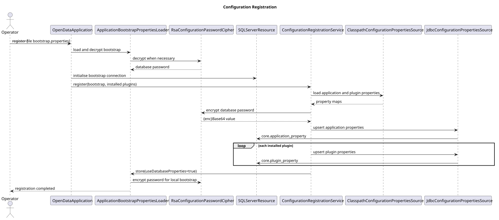

# Component Interactions

**Document ID:** ARCH-010  
**Version:** 2.0  
**Status:** Version 2.0.0 implementation baseline  
**Baseline date:** 3 August 2026  
**Minimum Java version:** 17

---

## Control commands

`--help` and `--list-plugins` do not initialise SQL Server. `--register` loads
the bootstrap values, opens SQL Server, stores application and plugin properties,
encrypts the password, and rewrites the bootstrap file with
`application.use-database-properties=true`.

## Execution

The CLI creates immutable arguments. The bootstrap loader reads the writable
source-tree properties file and decrypts an `{enc}` password when present.
`OpenDataApplication` chooses a classpath or JDBC property source, loads runtime
configuration, resolves one or more enabled descriptors and builds validated
`PluginDefinition` values.

The coordinator submits independent tasks. The reflection factory constructs a
fresh plugin. Each task receives its run id, clock, dry-run state and database
resource and returns standard metrics. `OpenDataApplication` logs an ordered
summary; `OpenData` logs the final status and duration.

Write runs use the DBCP pool and `JdbcPluginRunAudit`. During plugin execution,
dry runs use an unavailable database resource and no-op audit. Any plugin that
requests a connection in that phase fails rather than writing.

## Source-specific flows

- **Ofgem:** discover the current workbook link on the official publication
  page, download XLSX, extract and validate annual levelised cap data, persist a
  period transaction and optionally archive the workbook.
- **OpenMeteo:** resolve a date range, call the archive API, parse aligned JSON
  arrays, transform daily records and perform an idempotent location/date upsert.
- **Octopus:** discover matching local PDFs, hash and filter completed files,
  extract PDF text, parse electricity and gas records, commit the batch and move
  successful source files to the archive directory.

::: {.landscape}
{width=22.5cm}

{width=22.5cm}

{width=22.5cm}
:::
