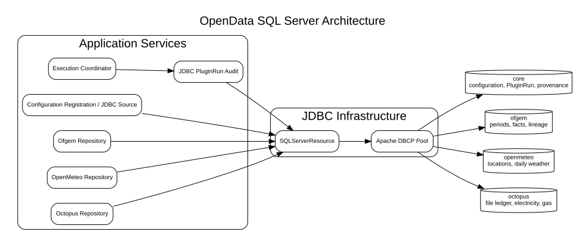
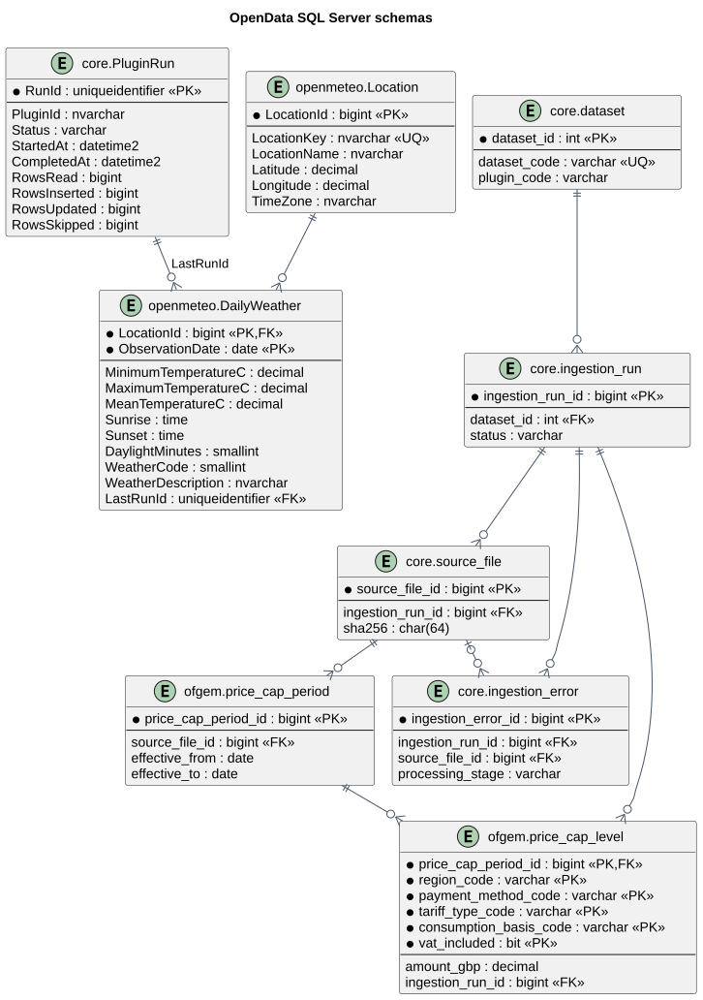

# Database Architecture

**Document ID:** ARCH-014  
**Version:** 2.0  
**Status:** Implemented for SQL Server  
**Baseline date:** 3 August 2026  
**Minimum Java version:** 24

---

## Scope

SQL Server is the current persistence target. Database-neutral Java contracts
isolate connection acquisition and repository responsibilities, but the
implementation deliberately uses SQL Server syntax and features. Supporting a
second database requires new resource and repository implementations.

## Logical schemas

The `OpenData` database is divided by responsibility:

- `core` contains schema versions, application/plugin configuration,
  `PluginRun`, ingestion/provenance tables and shared reference data;
- `ofgem` contains price-cap periods, dimensional annual cap facts and source
  lineage;
- `openmeteo` contains stable locations and daily weather facts;
- `octopus` contains the processed-statement ledger and electricity/gas billing
  facts.

Framework metadata and provider business records are separated. New plugins
receive their own schema unless a genuinely shared framework concept belongs in
`core`.

## Java persistence boundary

- `DatabaseResourceManager` supplies borrowed connections and owns lifecycle;
- `SQLServerResource` configures Apache DBCP pooling;
- `JdbcConfigurationPropertiesSource` owns configuration-store SQL;
- `JdbcPluginRunAudit` owns `core.PluginRun` lifecycle SQL;
- provider-local repositories own business SQL and transactions;
- older `DatabaseConnectionManager`, `DatabasePoolConfig` and generic repository
  classes remain in the source but are not the active application composition.

Closing a borrowed connection returns it to the pool. Provider repositories use
try-with-resources and restore relevant connection/session state before return.

## Transaction boundaries

- **Ofgem:** one transaction covers provenance, period upsert, current-period
  state and fact replacement.
- **OpenMeteo:** one transaction covers location upsert and daily staging,
  update and insert operations, protected by a location-scoped application lock.
- **Octopus:** one transaction inserts or updates electricity/gas records and
  marks each source file `COMPLETED`; source PDFs are moved only after the
  transaction returns successfully.
- **Configuration registration:** application and plugin groups are upserted by
  the JDBC configuration source; the bootstrap rewrite occurs after database
  registration and is not part of a distributed transaction.

A file-system archive action cannot participate in a SQL transaction. A failure
after commit but before archive is therefore recoverable operational work rather
than a database rollback condition.

## Schema management

Numbered SQL scripts in `/sql` are intended for ordered, repeatable execution.
`core.schema_version` records installed steps. The current repository uses
explicit SQL rather than Flyway or Liquibase. Fresh-install, repeat-install,
rollback and least-privilege tests remain release acceptance gates.

## Security

Administrative scripts are run by a privileged operator. The application login
and database user are `OpenData`, with operational permissions granted through
`opendata_app`. Production transport requires a trusted SQL Server certificate
and `trustServerCertificate=false`.

See [database persistence and pooling](019-database-persistence-and-pooling.md)
and [security and credentials](017-security-and-credentials.md).

::: {.landscape}
{width=22.5cm}
:::

{width=16cm}
