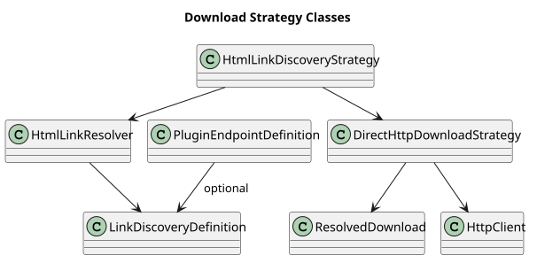

# Download and Parsing Architecture

**Document ID:** ARCH-016  
**Version:** 1.0  
**Status:** Baseline  
**Baseline date:** 23 July 2026  
**Minimum Java version:** 17

---

`PluginEndpointDefinition` describes method, URI, source format, strategy,
headers, query parameters, credential reference and optional discovery rules.

Direct HTTP uses the JDK client, validates 2xx, streams to `.part` and moves the
completed file. HTML discovery uses JSoup selectors and href/text regular
expressions, resolves relative URLs and delegates the file download.

CSV uses Commons CSV, JSON uses Jackson and XLS/XLSX uses Apache POI. HTML-table
and ZIP stages are planned.

`String.split` is prohibited for general CSV. Excel formatting uses
`DataFormatter` and optional formula evaluation. Source retention is
plugin-specific: Ofgem optionally archives after successful extraction in write
mode; the generic parsers and OpenMeteo path do not archive automatically.

::: {.landscape}
{width=22.5cm}
:::
