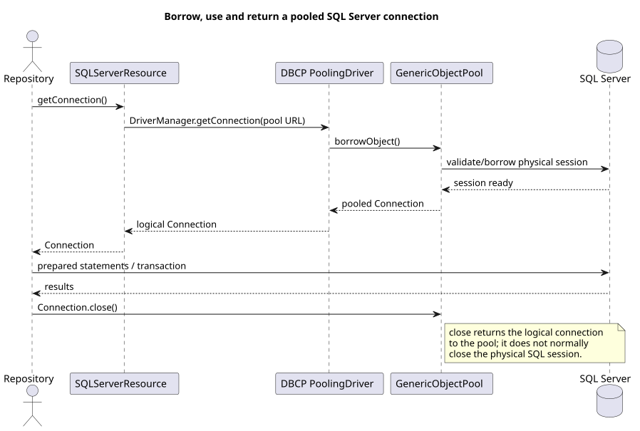

# Database Persistence and Connection Pooling

**Document ID:** ARCH-019  
**Version:** 2.0  
**Status:** Implemented for the current plugin runtime  
**Baseline date:** 24 July 2026

## Purpose

The database layer supports concurrent plugin tasks while bounding physical SQL Server sessions. Every repository operation borrows its own logical JDBC connection and returns it using try-with-resources.

## Active components

| Component | Responsibility |
|---|---|
| `DatabasePoolConfiguration` | Immutable driver, URL, credentials, pool size, wait and validation settings |
| `SQLServerResource` | Process-level Apache Commons DBCP pool and `DatabaseResourceManager` implementation |
| `DatabaseConnectionManager` | Compatibility facade used by the older repository foundation |
| `DatabaseHealthCheck` | Low-cost connectivity check |
| JDBC repository implementations | Prepared SQL, transaction ownership and result counters |

`DatabasePoolConfig` and `DatabasePoolSnapshot` remain in the source tree as earlier abstractions; they are not the configuration objects used by `OpenDataApplication` in the current runtime.

## Configured defaults

The maintained values are in `src/main/resources/config/application.properties`:

| Setting | Default |
|---|---:|
| `database.pool.max-total` | 8 |
| `database.pool.max-idle` | 8 |
| `database.pool.min-idle` | 1 |
| `database.pool.max-wait-seconds` | 30 |
| `database.pool.validation-query` | `SELECT 1` |
| `execution.max-parallel-plugins` | 4 |

The pool is prepared during a normal database-writing run. A dry run uses `UnavailableDatabaseResourceManager` and does not create the SQL Server pool.

## Lifecycle and transaction rules

1. Resolve and validate runtime configuration.
2. Initialise one `SQLServerResource` for the process.
3. Give each plugin task access to the shared thread-safe resource manager.
4. Borrow one connection per repository transaction; never share a `Connection`, `Statement` or `ResultSet` between plugin threads.
5. Commit or roll back in the repository that owns the transaction.
6. Close the resource manager once application execution completes.

Increasing plugin parallelism without increasing database capacity can cause pool waits. As an operating guideline, configure at least the expected concurrent database transactions plus a small allowance for audit operations.

