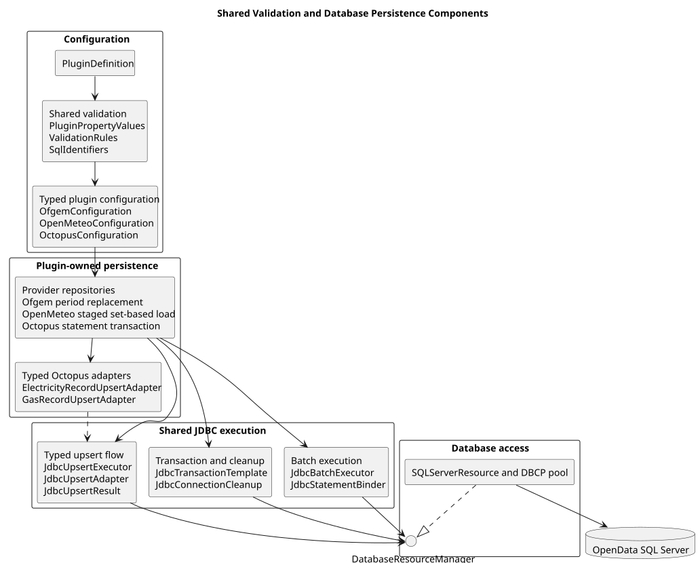

# Database Persistence and Connection Pooling

**Document ID:** ARCH-019
**Version:** 2.0
**Status:** Implemented in Version 2.0.0
**Baseline date:** 4 August 2026

---

## Purpose

The database layer supports bounded parallel plugin execution without opening a
new physical SQL Server connection for every statement. Provider repositories
retain explicit SQL and schema ownership while shared JDBC components implement
repeated connection, transaction, batch and typed upsert mechanics.

## Components

| Component | Responsibility |
|---|---|
| `DatabasePoolConfiguration` | Runtime SQL Server and pool settings |
| `SQLServerResource` | Process singleton backed by DBCP `GenericObjectPool` and `PoolingDriver` |
| `DatabaseResourceManager` | Connection and pool facade supplied to runtime components |
| `DatabasePoolSnapshot` | Active, idle and configured pool capacity |
| `JdbcTransactionTemplate` | Borrow, commit, roll back, clean and restore a connection |
| `JdbcBatchExecutor` | Prepared-statement batching and result counting |
| `JdbcUpsertExecutor` | Common typed exists/insert/update control flow |
| plugin repositories and adapters | Provider SQL, natural keys, bindings and persistence policy |

## Pool defaults

| Setting | Default | Purpose |
|---|---:|---|
| minimum idle | 1 | Keep one reusable connection available |
| maximum idle | 8 | Bound retained idle sessions |
| maximum total | 8 | Bound concurrent borrowed connections |
| maximum wait | 30 seconds | Fail rather than wait indefinitely |
| validation query | `SELECT 1` | Verify a borrowed SQL Server connection |

These are conservative application defaults, not universal production values.
Pool sizing must account for plugin parallelism, SQL Server capacity and the
number of application processes.

## Transaction lifecycle

1. a repository calls `JdbcTransactionTemplate.execute`;
2. the template borrows one logical connection from `DatabaseResourceManager`;
3. the original auto-commit state is retained and auto-commit is disabled;
4. the provider callback executes explicit SQL;
5. success commits, while failure triggers rollback;
6. optional `JdbcConnectionCleanup` removes connection-scoped state;
7. the original auto-commit state is restored;
8. try-with-resources returns the logical connection to the pool.

Rollback and cleanup failures are attached to the primary failure as suppressed
exceptions. Checked callback failures are translated to
`DatabaseAccessException` at the template boundary.

## Pooled SQL Server session state

Closing a pooled logical connection does not guarantee that a local temporary
table or SQL Server `SET` option has disappeared from the underlying physical
session. A repository that creates such state must provide a cleanup callback.
OpenMeteo uses this mechanism to remove `#OpenMeteoDaily` and reset
`XACT_ABORT` after commit or rollback.

## Persistence strategy ownership

Ofgem uses explicit provenance and period-replacement SQL plus shared transaction
and batch mechanics. OpenMeteo uses a staged set-based strategy plus shared
transaction and staging batches. Octopus uses separate electricity and gas SQL
adapters with a shared typed upsert executor.

The shared package does not infer schemas, columns or natural keys and does not
replace prepared statements or provider integration tests.

## Failure behaviour

- invalid pool or batch values fail during configuration or call validation;
- pool exhaustion fails after `database.pool.max-wait-seconds`;
- connection validation prevents a failed session being handed to a repository;
- batch execution fails if the JDBC driver reports `EXECUTE_FAILED`;
- repository SQL exceptions are translated at the transaction boundary;
- cleanup failures do not conceal an earlier SQL or transformation failure;
- closing an individual borrowed connection must not close the pool;
- closing the pool makes later borrows fail clearly.

See [Shared Validation and JDBC Infrastructure](028-shared-validation-and-jdbc-infrastructure.md)
for plugin-author guidance.

::: {.landscape}
{width=22.5cm}
:::
