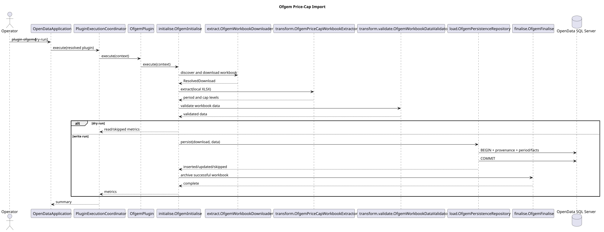

# Ofgem Price-Cap Architecture

**Document ID:** ARCH-021
**Version:** 3.0.0  
**Status:** Runtime and shared persistence integration implemented; live write acceptance pending
**Baseline date:** 15 August 2026  

---

## Scope

The Ofgem plugin imports the primary annual levelised default-tariff-cap output
from worksheet `1a Levelised DTC`. It remains the reference plugin for HTML link
discovery, Excel extraction, source-cell lineage and transactional period
replacement.

## Active flow

1. `OfgemPlugin` delegates to `initialise.OfgemInitialise`.
2. `initialise.OfgemConfiguration` resolves typed settings from the registered
   `PluginDefinition`.
3. `extract.OfgemWorkbookDownloader` discovers and downloads the preferred XLSX.
4. `transform.OfgemPriceCapWorkbookExtractor` maps period and dimensional values.
5. `transform.validate.OfgemWorkbookDataValidator` rejects invalid, duplicate or
   lineage-free values.
6. `load.OfgemLoad` stops before persistence during dry run.
7. `load.OfgemPersistenceRepository` writes provenance, period and level rows in
   one transaction.
8. `finalise.OfgemFinalise` archives the workbook after a successful write run.

## Shared configuration processing

`OfgemConfiguration` no longer maintains provider-local text, duration or
boolean parsers. It uses:

| Shared component | Ofgem use |
|---|---|
| `PluginPropertyValues` | output filename, ISO-8601 timeouts, archive flag and directories |
| `ValidationRules.requireText` | non-blank output filename |
| `ValidationRules.requirePositive` | positive connection and request timeouts |

The plugin-specific defaults and endpoint name remain in `OfgemConfiguration`.
This keeps domain defaults close to the provider while ensuring parsing and
error behaviour are consistent with other plugins.

## Shared transaction and batch processing

`OfgemPersistenceRepository` owns Ofgem SQL but delegates common mechanics to:

- `JdbcTransactionTemplate` for borrowing a connection, disabling auto-commit,
  committing, rolling back, restoring auto-commit and wrapping checked failures;
- `JdbcBatchExecutor` for parameterised price-cap-level insertion in batches of
  500.

The transaction still performs these Ofgem-specific operations:

1. resolve exactly one active dataset;
2. create ingestion-run and source-file provenance;
3. clear the previous current-period flag;
4. insert or update the identified period;
5. delete the period's previous level rows;
6. batch-insert the replacement level set; and
7. mark the ingestion run successful.

A failure at any point rolls back all seven operations.

## Domain and persistence semantics

`OfgemPriceCapPeriod` identifies the effective range and source column.
`OfgemPriceCapLevel` stores one annual GBP amount by region, payment method,
tariff type, consumption basis and VAT flag, with worksheet/cell lineage.

A new period reports inserted level rows. Re-importing an existing period
reports the level set as updated after replacing it transactionally. The shared
batch executor does not change the period-replacement business rule.

## Public compatibility

The following public entry points remain source-compatible and are documented
with `@since 2.0.0`:

- `OfgemConfiguration.from(PluginDefinition)`;
- `OfgemConfiguration.downloadPath()`;
- `OfgemPersistenceRepository(DatabaseResourceManager)`; and
- `OfgemPersistenceRepository.persist(...)`.

The removed provider-local parsing helpers were private and are not retained as
deprecated wrappers.

## Verification

Focused tests cover configuration defaults/custom values, transaction commit,
new-period persistence and shared batch execution. Full acceptance still
requires live SQL Server write, induced rollback, repeat import and
least-privilege permission tests.

::: {.landscape}
{width=22.5cm}
:::
