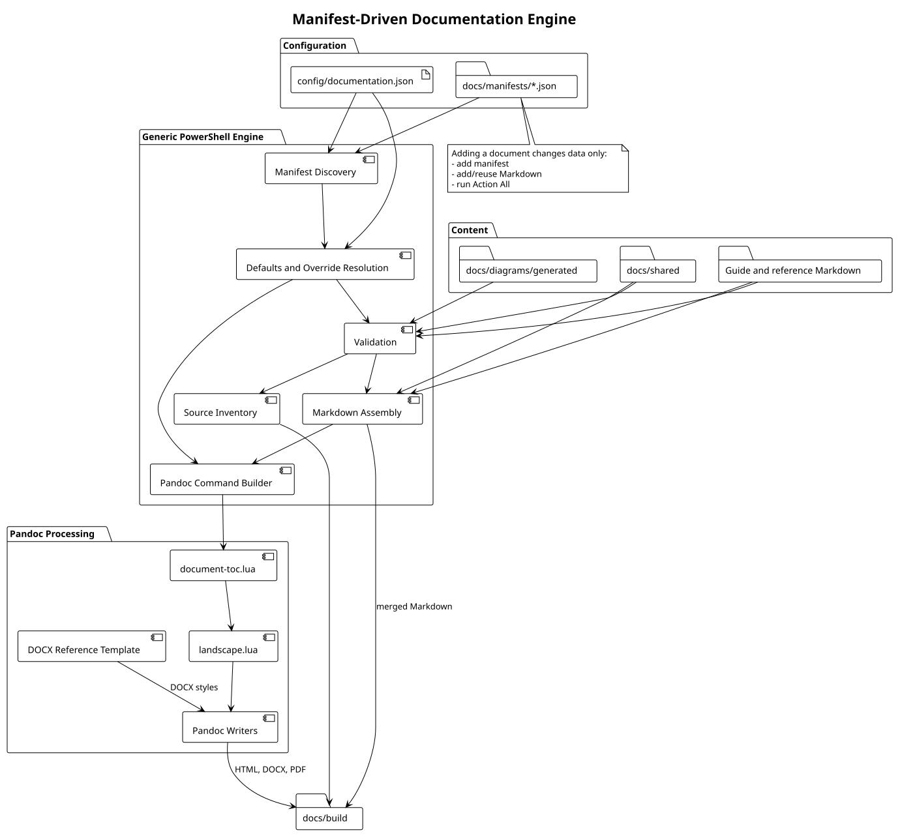
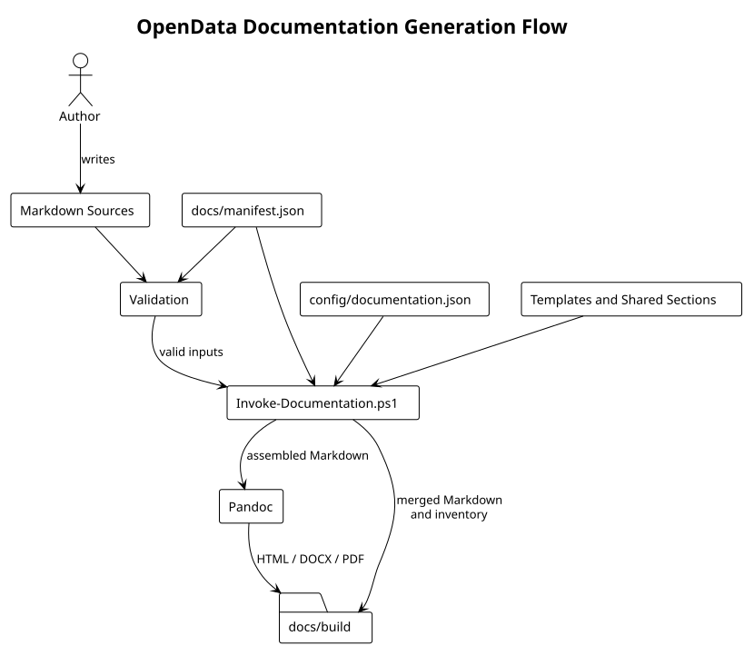

# Manifest-Driven Documentation Engine

**Document ID:** ARCH-025  
**Version:** 3.0.0  
**Status:** Implemented  
**Baseline date:** 15 August 2026  

---

## Purpose

The documentation subsystem is a generic processor for document manifests. It separates global tool configuration, per-document composition, shared front matter, Markdown sources and output-format concerns.

## Components

{width=16cm}

`config/documentation.json` contains project-wide settings and inherited defaults. Each JSON file in `docs/manifests` contains one document's identity, metadata and ordered sections. `Invoke-Documentation.ps1` discovers and normalises all manifests, validates their inputs, assembles Markdown and invokes Pandoc.

## Assembly sequence

{width=16cm}

The engine writes shared front matter before a `.document-toc` marker. The `document-toc.lua` filter replaces that marker with a format-appropriate TOC and suppresses automatic HTML/PDF title blocks, ensuring the cover remains the first document content. DOCX post-processing enables field refresh for the native Word TOC.

## Extensibility boundary

Document types are data, not PowerShell branches. A new guide is introduced by adding a manifest and Markdown. PowerShell changes are required only when the engine gains a new generic capability or output format.

## Related decisions

- [ADR-0017: Maintain documentation as code](../decisions/ADR-0017-documentation-as-code.md)
- [ADR-0045: Standardise the documentation delivery baseline](../decisions/ADR-0045-documentation-delivery-baseline.md)
- [ADR-0046: Use a manifest-driven documentation engine](../decisions/ADR-0046-manifest-driven-documentation-engine.md)
