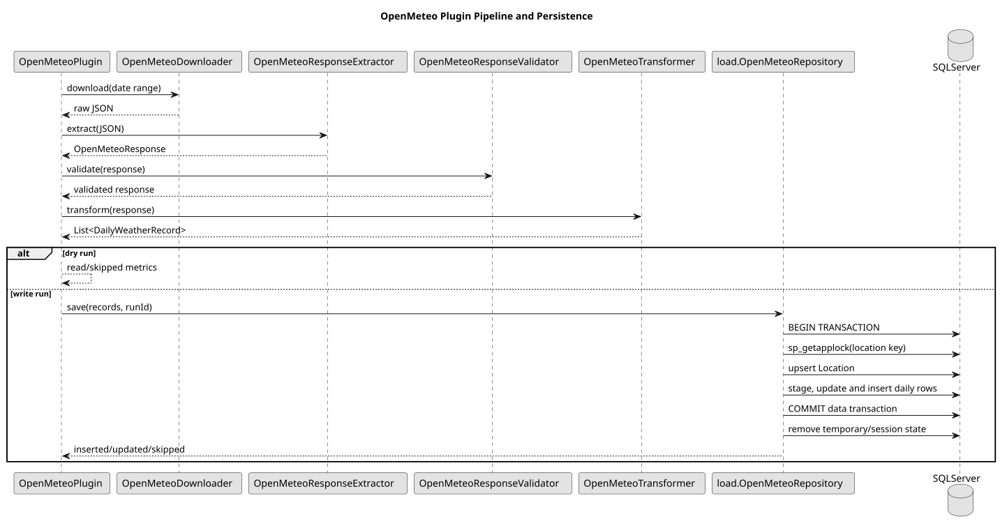
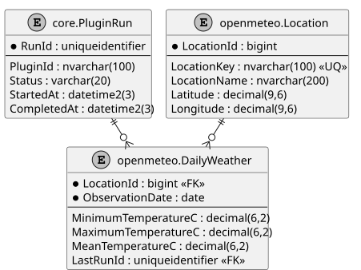

# OpenMeteo Historical Weather Architecture

**Document ID:** ARCH-026
**Version:** 2.0
**Status:** Runtime and persistence implemented; live acceptance pending
**Baseline date:** 3 August 2026

---

## Scope

The OpenMeteo plugin is the reference for a parameterised public JSON API. One
plugin definition represents one stable location and loads daily historical
weather observations into a dedicated relational schema.

## Active flow

1. resolve typed location, API, timeout, date and SQL settings;
2. build an archive-API request for the configured coordinates and timezone;
3. parse and validate aligned daily JSON arrays;
4. transform them into immutable `DailyWeatherRecord` values;
5. return read/skipped metrics during dry run, or persist in one transaction;
6. report final metrics.

## Date rule

Blank start resolves to `2000-01-01` and blank end to yesterday in the configured
timezone. The retained `default-start-days-ago` and `include-current-date`
properties are not currently applied.

## Concurrency and idempotency

The repository takes a location-scoped SQL Server application lock. It upserts
the location, stages daily records, inserts missing dates, updates changed rows
and skips unchanged values. It cleans temporary/session state before returning
the pooled connection.

::: {.landscape}
{width=22.5cm}
:::

{width=16cm}
