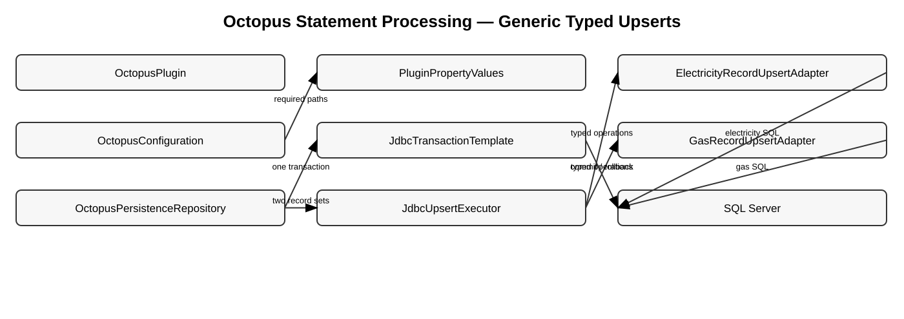
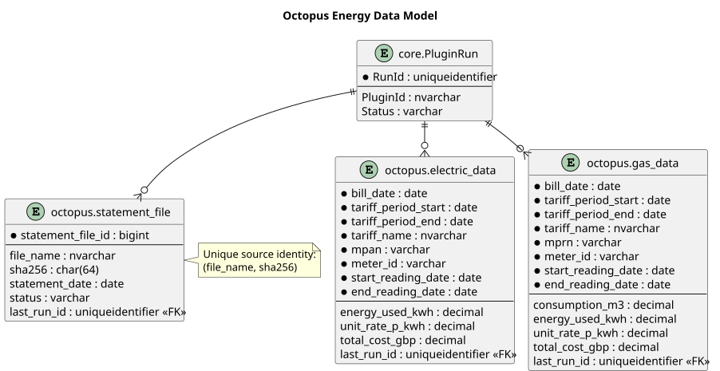

# Octopus Energy Statement Architecture

**Document ID:** ARCH-027
**Version:** 2.1
**Status:** Runtime, generic upsert integration and dry-run implemented; live acceptance pending
**Baseline date:** 4 August 2026

---

The Octopus plugin is the reference for local document ingestion, processed-file
idempotency and typed record upserts. It reads statements already downloaded to
a local folder; email, IMAP and direct account/API acquisition remain outside
Version 2.0.0 scope.

## Configuration

`OctopusConfiguration` uses `PluginPropertyValues.requiredPath(...)` for
`input.directory`, `working.directory` and `archive.directory`. The factory also
checks that the resolved plugin id is `octopus`.

The previous private path lookup was removed. Because it was not part of the
public API, no deprecated wrapper is retained.

## Write-mode flow

1. validate the input directory and select supported filenames;
2. calculate size and SHA-256;
3. read completed `(filename, hash)` keys;
4. extract text for new or changed candidates;
5. parse electricity and gas records;
6. persist business rows and completion ledger in one transaction; and
7. archive successfully committed PDFs.

## Shared transaction processing

`OctopusPersistenceRepository` uses `JdbcTransactionTemplate`. Electricity,
gas and statement-ledger writes therefore share one borrowed connection and one
commit/rollback boundary. The public constructor and `save(...)` method remain
source-compatible and are documented with `@since 2.0.0`.

## Generic electricity and gas upserts

The old repository repeated the same control flow for electricity and gas:
existence query, insert or update, then count the outcome. That control flow now
runs once through `JdbcUpsertExecutor`.

| Component | Responsibility |
|---|---|
| `JdbcUpsertExecutor` | common exists/insert/update iteration and counts |
| `AbstractOctopusUpsertAdapter<T>` | common prepared-statement mechanics |
| `ElectricityRecordUpsertAdapter` | electricity natural key, SQL and bindings |
| `GasRecordUpsertAdapter` | gas natural key, SQL and bindings |
| `OctopusPersistenceRepository` | transaction, combined counts and statement ledger |

The two typed adapters remain separate because electricity and gas have
different identifiers and columns. The abstraction removes duplicated control
flow without hiding provider SQL or using reflection-generated statements.

The two `JdbcUpsertResult` values are combined before constructing
`OctopusPersistenceResult`.

## Statement ledger

After both record groups succeed, every source statement is merged into
`octopus.statement_file` as `COMPLETED`. Ledger completion is in the same
transaction as the energy rows. A failure in either adapter or the ledger rolls
back the entire statement batch.

## Dry-run and archive boundary

Dry run performs discovery, hashing, text extraction and parsing but skips the
processed-file repository, business writes, generic audit write and archive.
File movement occurs after a successful database commit, so an archive failure
requires operational reconciliation and does not reverse committed data.

## Verification

Focused tests cover required path parsing, electricity insert/update, gas
insert/update, combined counts, statement ledger completion, commit, rollback
and auto-commit restoration. Live SQL Server idempotency, archive and
least-privilege tests remain release gates.

::: {.landscape}
{width=22.5cm}

{width=22.5cm}
:::
