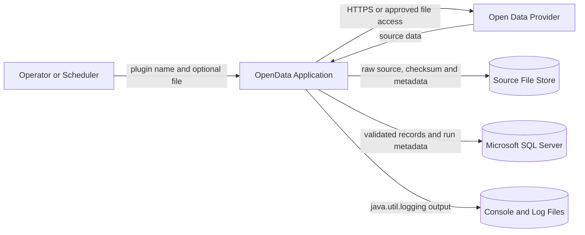
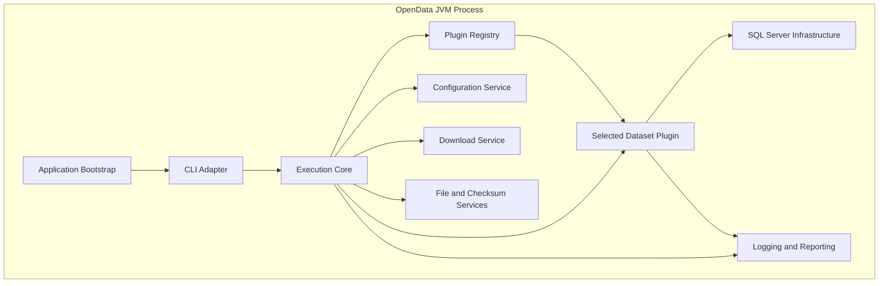
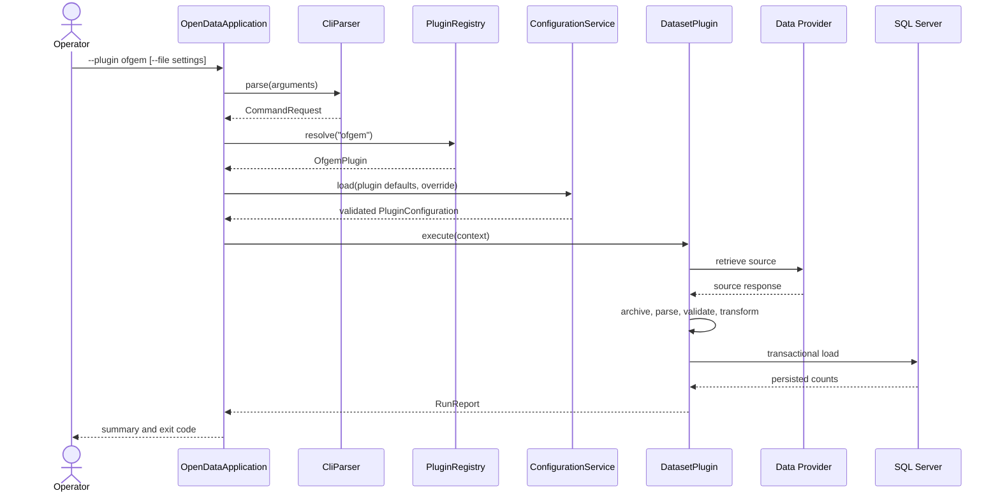
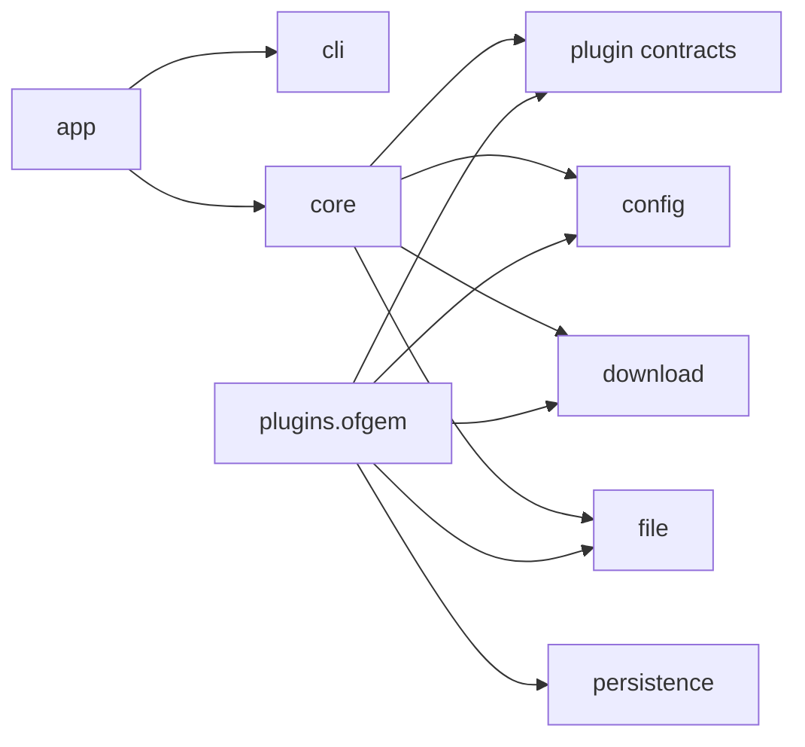

# OpenData Architecture

## 1. Document purpose

This document defines the target architecture for the OpenData project. It is the governing architecture for the framework and its dataset plugins.

The first supported dataset is the Ofgem Energy Price Cap dataset. The platform must nevertheless remain general enough for additional UK and international open-data sources.

## 2. Architecture summary

OpenData is a command-line Java application that:

1. Selects a dataset plugin.
2. Loads that plugin's default configuration.
3. Optionally overlays a user-supplied parameter file.
4. Downloads or reads source data.
5. Stores a traceable copy of the source.
6. Parses, validates, and transforms the data.
7. Loads validated records into SQL Server.
8. Records run and source metadata.
9. Produces clear logs, a summary, and a stable exit code.

Example:

```text
java -jar opendata.jar --plugin ofgem
```

With an override file:

```text
java -jar opendata.jar --plugin ofgem --file config/ofgem-local.properties
```

## 3. Fixed architectural decisions

| Concern | Decision |
|---|---|
| Base package | `com.towermarsh.opendata` |
| Application style | Command-line batch application |
| CLI parser | Apache Commons CLI |
| Logging API | `java.util.logging` |
| Extension model | Dataset plugins |
| Initial plugin | `ofgem` |
| Configuration model | Plugin defaults plus optional override file |
| Initial database | Microsoft SQL Server |
| Documentation | Markdown and JavaDoc |
| Package documentation | `package-info.java` |
| Initial deployment style | Modular monolith |

## 4. Goals

### 4.1 Functional goals

- Acquire open-data resources from remote providers.
- Support files and APIs where required by a dataset.
- Preserve source provenance.
- Convert untrusted external content into validated typed records.
- Load data efficiently and safely.
- Support repeatable re-runs.
- Make new datasets straightforward to add.

### 4.2 Quality goals

- **Maintainable:** small components with clear responsibilities.
- **Traceable:** every load is associated with a run and source artefact.
- **Reliable:** failures are explicit and do not silently corrupt data.
- **Idempotent:** reprocessing the same source does not create uncontrolled duplicates.
- **Testable:** external services are hidden behind interfaces.
- **Operationally simple:** one executable process with clear arguments and exit status.
- **Secure by default:** validate all external input and do not commit secrets.
- **Portable:** rely on standard Java APIs where practical.

## 5. Non-goals

The initial system is not intended to be:

- A graphical ETL designer.
- A browser-based administration system.
- A continuously running microservice platform.
- A general data warehouse.
- A scheduler.
- A replacement for database migration tooling.
- A mechanism for storing secrets in source control.

## 6. Architectural principles

1. Framework packages must not depend on concrete dataset plugins.
2. Plugins may depend only on documented framework contracts and approved shared services.
3. Dataset-specific parsing and validation must remain within that dataset's plugin.
4. CLI parsing must remain outside plugins.
5. Configuration must be immutable after validation.
6. A plugin run must return a structured result.
7. Raw source material must be treated as untrusted.
8. Database writes must use explicit transaction boundaries.
9. Logs must not expose secrets.
10. Major changes require an ADR.
11. Public classes and methods require JavaDoc.
12. Every package requires a `package-info.java`.

## 7. System context



## 8. Container view

OpenData begins as one deployable Java process, internally divided into modules.



## 9. Runtime lifecycle



## 10. Recommended repository structure

```text
OpenData/
├── pom.xml
├── README.md
├── config/
│   ├── examples/
│   └── local/                         # excluded from source control
├── docs/
│   ├── architecture/
│   ├── datasets/
│   │   └── ofgem/
│   ├── development/
│   └── operations/
├── scripts/
├── src/
│   ├── main/
│   │   ├── java/
│   │   │   └── com/towermarsh/opendata/
│   │   │       ├── app/
│   │   │       ├── cli/
│   │   │       ├── config/
│   │   │       ├── core/
│   │   │       ├── download/
│   │   │       ├── file/
│   │   │       ├── logging/
│   │   │       ├── persistence/
│   │   │       ├── plugin/
│   │   │       └── plugins/
│   │   │           └── ofgem/
│   │   └── resources/
│   │       ├── logging.properties
│   │       └── plugins/
│   │           └── ofgem/
│   │               └── default.properties
│   └── test/
│       ├── java/
│       └── resources/
└── target/
```

## 11. Dependency direction



The arrows represent compile-time dependency. The core must never depend on `plugins.ofgem`.

## 12. Error model

Errors are classified so that logs, summaries, and exit codes are consistent.

| Category | Examples | Default result |
|---|---|---|
| Usage | Missing plugin, unknown option | Do not start a run |
| Configuration | Invalid URL, missing required property | Fail before acquisition |
| Acquisition | HTTP failure, timeout, unexpected status | Fail or retry according to policy |
| Source integrity | Checksum mismatch, empty response | Reject source |
| Parsing | Invalid format or malformed record | Fail or quarantine according to plugin policy |
| Validation | Out-of-range or inconsistent value | Reject record or source according to policy |
| Persistence | SQL error, deadlock, constraint failure | Roll back transaction |
| Internal | Programming defect or unexpected state | Fail and retain diagnostic context |

## 13. Run identity and traceability

Every execution receives a unique `runId`.

At minimum, run metadata records:

- Run ID.
- Plugin ID and plugin version.
- Start and end timestamps.
- Effective configuration fingerprint.
- Source URI.
- Source retrieval timestamp.
- Source file path.
- Source checksum.
- Source content type and size.
- Records read, accepted, rejected, inserted, updated, and unchanged.
- Final status.
- Error category and safe diagnostic message.

## 14. Concurrency

The first implementation processes one plugin run in one JVM process. Internal parallelism should not be introduced until profiling proves it is necessary.

When concurrent processing is later added:

- Concurrency must be bounded.
- Records must not be shared through mutable global state.
- Database batching must preserve transaction semantics.
- Source files must use collision-safe paths.
- Run IDs must remain unique.

## 15. Compatibility and evolution

- Plugin interfaces should remain small.
- Breaking contract changes require a major application version and an ADR.
- Database schema changes must be supplied as reviewed migration scripts.
- Configuration keys should not be silently redefined.
- Deprecated keys must generate warnings before removal.
- Source-format changes should be detected through contract tests.

## 16. Architecture fitness checks

The build should eventually enforce:

- No framework dependency on `plugins..`.
- No logging framework other than JUL in project source.
- Every production package contains `package-info.java`.
- No direct `DriverManager` usage outside the persistence package.
- No direct `HttpClient` usage outside the download package.
- No plugin reads raw CLI arguments.
- No credentials appear in committed configuration.
