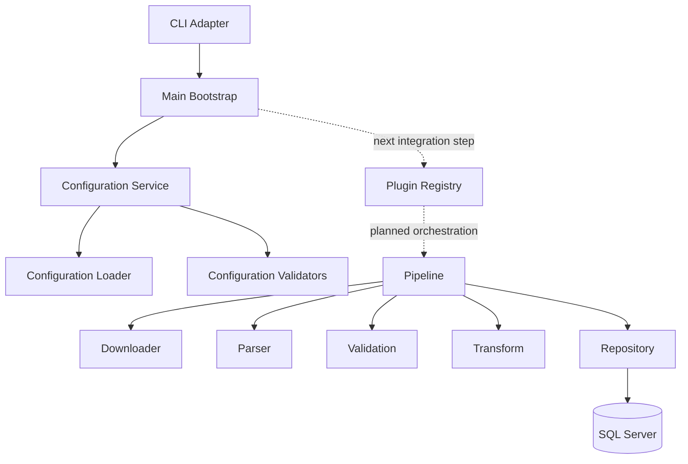

# OpenData Architecture

## 1. Purpose

OpenData is a modular Java framework for processing public datasets through a repeatable extract, transform, validate, and load workflow.

This document describes the architecture represented by the current codebase. Planned capabilities are marked explicitly.

## 2. Current implementation boundary

The codebase currently implements framework foundations and a command-line/configuration bootstrap.

Implemented:

- command-line parsing and control commands;
- configuration loading, resolution, and validation;
- immutable domain and result models;
- download, parser, validation, ETL, and persistence contracts;
- concrete HTTP, CSV, JSON, and SQL Server adapters;
- logging and exception conventions.

Partially implemented:

- composition of services into a complete executable pipeline;
- Ofgem plugin exposure through a real plugin registry;
- business-table loading and metadata persistence.

Deferred or shelved:

- internal scheduler;
- database-hosted plugin configuration;
- dynamic external plugin loading;
- multiple production database engines.

## 3. Architectural style

The system is a modular monolith.



Components are separated by Java packages and interfaces but are deployed in one application artifact.

## 4. Runtime bootstrap

`Main` is intentionally small. It owns process-level concerns:

- parsing command-line input;
- displaying help, version, and installed-plugin information;
- resolving application configuration;
- mapping failures to process exit codes;
- logging unexpected failures.

It does not yet instantiate and execute the complete plugin/pipeline graph.

### Exit codes

| Code | Meaning |
|---:|---|
| 0 | Successful command or normal completion |
| 1 | Unexpected runtime failure |
| 2 | Command-line processing error |
| 3 | Configuration error |

## 5. Command-line architecture

The `cli` package contains:

- `CommandLineArguments` — immutable parsed command model;
- `CommandLineArgumentsProcessor` — Apache Commons CLI adapter;
- `CommandLineProcessingException` — boundary exception;
- package documentation.

The CLI model supports ordinary execution and control requests such as help, version, and plugin listing.

## 6. Configuration architecture

Configuration is processed in two stages:

1. `ConfigurationLoader` resolves defaults and overrides into `ApplicationConfig`.
2. `ConfigurationService` applies one or more `ConfigurationValidator` implementations.

The default service uses `StandardConfigurationValidator`. Validators are copied into an immutable list and supplied through constructor injection.

Configuration remains properties-file based. Database-hosted plugin configuration remains a future option.

## 7. Domain model

Records are used for immutable value objects where practical. Current model classes include:

- `DataFile`
- `DataSourceDefinition`
- `DatasetDefinition`
- `DownloadResult`
- `ImportResult`
- `ValidationResult`
- command-line and application configuration records

These types transfer data between framework boundaries without exposing mutable shared state.

## 8. Download architecture

`DataDownloader` defines the download contract.

`HttpDataDownloader` is the current adapter and uses the JDK HTTP client. `DownloadResult` captures the outcome.

Responsibilities include:

- issuing HTTP requests;
- applying configured timeouts and headers;
- writing or returning downloaded content;
- translating transport failures into framework exceptions.

## 9. Parsing architecture

`DataParser` defines parsing behaviour.

Current concrete adapters:

- `CsvDataParser`, using Apache Commons CSV;
- `JsonDataParser`, using Jackson Databind.

Dataset-specific mapping should sit above these general format adapters.

## 10. Validation architecture

`Validator` defines a validation boundary.

`DataQualityValidator` provides the current quality-validation implementation and returns `ValidationResult`.

Configuration validation is deliberately separate from dataset validation:

- configuration validators check whether an invocation can run;
- data validators check downloaded or transformed data.

## 11. ETL services

The `etl` package currently exposes:

- `ExtractService`
- `TransformService`
- `LoadService`

These services define stage boundaries. A complete pipeline coordinator is not yet wired into the executable bootstrap.

The intended stage order is:

```text
Resolve configuration
        ↓
Select plugin
        ↓
Extract/download
        ↓
Parse
        ↓
Validate
        ↓
Transform
        ↓
Load
        ↓
Report result
```

## 12. Persistence architecture

`DatabaseRepository` is the persistence abstraction.

`SqlServerRepository` is the current concrete implementation and uses `DatabaseConnectionManager`.

SQL Server is the supported first database. Database independence is an architectural seam, not a claim that multiple engines are currently production-ready.

## 13. Logging

The framework standard is `java.util.logging`.

Libraries should not introduce a second application logging API. Boundary classes log operational context; exceptions retain the underlying cause.

## 14. Exception strategy

`OpenDataException` is the framework base exception.

Current specialised exceptions include:

- `ConfigurationException`
- `DownloadException`
- `ImportException`
- `ValidationException`

CLI processing has its own boundary exception in the `cli` package.

Exceptions are translated at architectural boundaries and finally mapped to user output or exit codes by `Main`.

## 15. Dependency direction

Preferred dependency direction:

```text
Main / CLI
    ↓
Configuration and orchestration
    ↓
ETL contracts and domain models
    ↓
Adapters: HTTP, CSV, JSON, SQL Server
```

Rules:

- domain records must not depend on adapters;
- interfaces should sit with the layer that owns the abstraction;
- concrete adapters may depend on external libraries;
- `Main` should remain composition and process control, not business logic;
- package cycles are prohibited.

## 16. Security considerations

- credentials must not be committed;
- secrets should be supplied through protected override files or another secure external mechanism;
- URLs and file paths require validation;
- downloads should use HTTPS;
- SQL must use parameterised statements;
- logged configuration must exclude secrets;
- third-party dependencies require periodic review.

## 17. Deployment

The current deployment unit is one Maven-built Java application.

External operating-system or platform scheduling is preferred while internal scheduling remains deferred.

## 18. Future architecture

The following are valid future directions but are not current behaviour:

- real plugin registry and plugin metadata;
- Ofgem plugin pipeline completion;
- database-backed JSON plugin settings;
- framework run-history and dataset metadata tables;
- internal scheduling;
- additional database adapters;
- richer pipeline verification and restartability.
