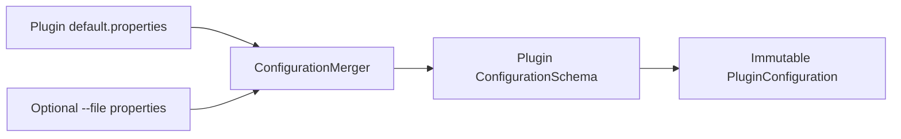

# Configuration Architecture

## 1. Command-line model

OpenData uses Apache Commons CLI for global application options.

Required normal-run option:

```text
--plugin <plugin-id>
```

Optional parameter-file override:

```text
--file <path>
```

Example:

```text
java -jar opendata.jar --plugin ofgem --file config/local/ofgem.properties
```

## 2. Precedence

Configuration precedence is intentionally simple:

```text
1. Plugin packaged defaults
2. User-supplied --file override
```

The override file wins for keys it contains.

There is no implicit environment-variable layer.



## 3. Default parameter files

Each plugin owns a resource:

```text
src/main/resources/plugins/<plugin-id>/default.properties
```

For Ofgem:

```text
src/main/resources/plugins/ofgem/default.properties
```

Defaults should be safe and portable. Machine-specific paths and credentials must not be committed as working defaults.

## 4. Override parameter files

Override files:

- Use UTF-8.
- Use Java properties syntax.
- Are supplied explicitly with `--file`.
- May contain only keys recognised by the selected plugin or approved global keys.
- Must fail fast on unknown keys by default.
- Should normally live under `config/local/`, which is ignored by Git.

Example:

```properties
archive.directory=D:/OpenData/archive/ofgem

database.url=jdbc:sqlserver://localhost;databaseName=OpenData;encrypt=true;trustServerCertificate=true
database.user=opendata_loader
database.passwordFile=C:/Secure/OpenData/sql-password.txt
```

A password file or operating-system credential mechanism is preferable to embedding a password directly in the general settings file.

## 5. Typed configuration

The configuration layer converts raw text to types such as:

- `URI`
- `Path`
- `Duration`
- `int`
- `long`
- `boolean`
- `LocalDate`
- plugin-specific enum

Conversion and validation happen once before plugin execution.

## 6. Schema definition

A plugin schema should define, for every key:

- Name.
- Description.
- Type.
- Required or optional status.
- Default source.
- Secret flag.
- Constraints.
- Deprecation status.

Illustrative API:

```java
ConfigurationSchema schema = ConfigurationSchema.builder("ofgem")
    .requiredUri("source.url")
    .optionalDuration("source.connectTimeout", Duration.ofSeconds(30))
    .optionalPath("archive.directory", Path.of("data/archive/ofgem"))
    .optionalPositiveInt("database.batchSize", 500)
    .secret("database.password")
    .build();
```

## 7. Validation

Validation includes:

### Key-level

- Required key present.
- Value converts to expected type.
- Numeric bounds.
- Allowed enumeration.
- URI scheme allowed.
- Path syntactically valid.

### Cross-key

- Target table supplied when database loading is enabled.
- Password and password-file keys are mutually exclusive.
- Incremental date range has start not after end.
- Archive directory is writable.
- HTTPS is required unless a documented exception exists.

## 8. Secret handling

Secrets must:

- Never appear in logs.
- Never appear in configuration fingerprints.
- Never be included in exception messages.
- Be held for the shortest practical lifetime.
- Be loaded from an approved local source.
- Not be committed to Git.

## 9. Effective configuration report

At startup, OpenData may log a safe summary such as:

```text
plugin=ofgem
source.url=https://...
archive.directory=D:\OpenData\archive\ofgem
database.url=jdbc:sqlserver://localhost;databaseName=OpenData;...
database.user=opendata_loader
database.password=<redacted>
database.batchSize=500
```

## 10. File discovery rule

The application must not silently search arbitrary directories for an override file.

An override is loaded only when explicitly supplied:

```text
--file path
```

This prevents unexpected configuration from being selected.
