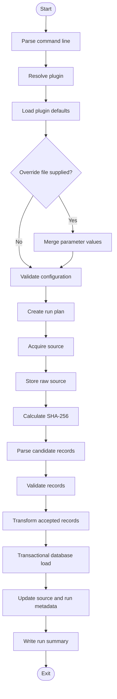
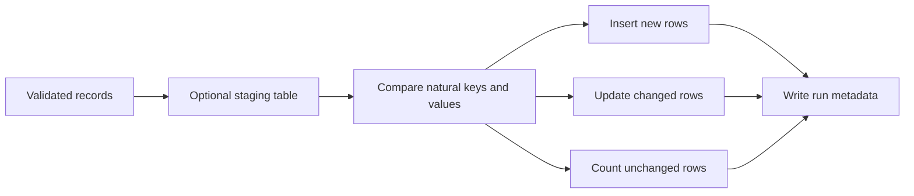

# Data Flow Architecture

## 1. End-to-end flow



## 2. Acquisition

The source is downloaded using the shared `DownloadService`.

The service records:

- Requested URI.
- Effective URI after approved redirects.
- HTTP status.
- Retrieval timestamp.
- Response content type.
- Content length when supplied.
- Bytes written.
- ETag and Last-Modified when supplied.
- SHA-256 checksum.
- Local archive path.

Content should be streamed to a temporary file. The file becomes visible at its final path only after successful completion.

## 3. Source archive layout

Recommended layout:

```text
data/
└── archive/
    └── ofgem/
        └── 2026/
            └── 07/
                └── 21/
                    └── <run-id>/
                        ├── source.csv
                        └── source-metadata.json
```

The original provider filename may be preserved after sanitisation.

## 4. Parsing

Parsing converts bytes or text into candidate records.

A parser must:

- Use an explicit character encoding.
- Handle headers deterministically.
- Preserve source row numbers.
- Reject unexpectedly missing required columns.
- Distinguish absent, blank, and invalid values.
- Avoid converting invalid data into plausible defaults.
- Produce useful parse errors without exposing entire sensitive files.

## 5. Validation

Validation occurs in two stages.

### 5.1 Source-level validation

- Required columns present.
- Supported source version.
- Expected date or period coverage.
- Non-empty content.
- File type and content type consistent.
- Duplicate headers not present.

### 5.2 Record-level validation

- Required values present.
- Numeric ranges valid.
- Dates and periods valid.
- Enumerations recognised.
- Cross-field rules satisfied.
- Natural key complete.

Rejected records should carry:

- Source row number.
- Validation code.
- Safe reason.
- Relevant field name.
- Safe source value where appropriate.

## 6. Transformation

Transformation maps accepted source records to stable domain and persistence records.

Transformation rules must be:

- Deterministic.
- Unit tested.
- Explicit about rounding.
- Explicit about timezone.
- Explicit about null handling.
- Independent from JDBC.

## 7. Persistence



For small datasets, direct prepared-statement merge logic may be sufficient. For larger datasets, a staging table and set-based SQL Server merge procedure may be more efficient.

`MERGE` syntax in SQL Server must be used cautiously. Separate `UPDATE` and `INSERT` statements may be preferred where correctness or concurrency concerns justify them.

## 8. Idempotency

A plugin must define a natural key or stable source identifier.

Idempotency is achieved by:

- Storing source checksum.
- Detecting an already processed identical source.
- Using unique database constraints.
- Comparing current and incoming values.
- Recording inserted, updated, and unchanged counts.
- Keeping transaction boundaries explicit.

## 9. Failure paths

| Failure point | Required behaviour |
|---|---|
| Configuration | Stop before creating a database transaction |
| Download | Remove incomplete temporary file |
| Source validation | Retain source only according to retention policy |
| Parsing | Record source-level failure and stop or quarantine |
| Record validation | Reject record or fail the run according to plugin policy |
| Persistence | Roll back the current transaction |
| Metadata update | Treat failure as a run failure unless separately recoverable |

## 10. Dry-run flow

With `--dry-run`:

- Parse CLI.
- Resolve plugin.
- Load and validate configuration.
- Confirm archive paths and database target.
- Optionally test source reachability.
- Do not perform database mutation.
- Produce a run plan and validation summary.
