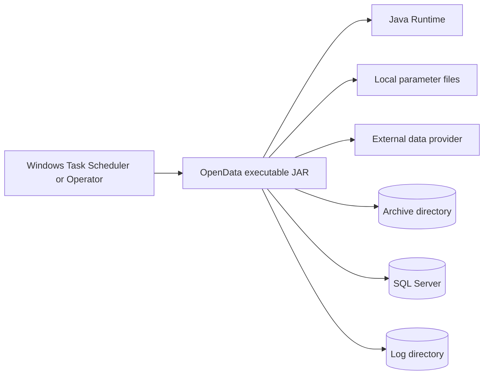

# Deployment Architecture

## 1. Deployment model

OpenData is initially deployed as a single runnable Java application.



## 2. Runtime prerequisites

- Supported Java runtime defined by the project build.
- Network access to approved provider endpoints.
- SQL Server network access.
- Write access to archive and log directories.
- Read access to explicitly supplied parameter and secret files.
- Microsoft SQL Server JDBC driver included through Maven dependency management.

## 3. Build artefact

Recommended output:

```text
opendata-<version>.jar
```

A self-contained executable JAR may be produced with Maven Shade Plugin or an equivalent approved mechanism.

The build should also publish:

- Source JAR.
- JavaDoc JAR.
- Checksums.
- Versioned database scripts.
- Release notes.

## 4. Example installation

```text
C:\OpenData\
├── bin\
│   └── opendata.jar
├── config\
│   └── ofgem.properties
├── secrets\
│   └── sql-password.txt
├── data\
│   └── archive\
├── logs\
└── scripts\
```

Permissions should be restricted to the service account and administrators.

## 5. Scheduling

Scheduling is external to the application.

Example Windows Task Scheduler action:

```text
Program:
C:\Program Files\Eclipse Adoptium\jdk\bin\java.exe

Arguments:
-jar C:\OpenData\bin\opendata.jar --plugin ofgem --file C:\OpenData\config\ofgem.properties

Start in:
C:\OpenData
```

The scheduler should use the process exit code to determine success.

## 6. Exit codes

Suggested codes:

| Code | Meaning |
|---:|---|
| `0` | Success |
| `1` | General execution failure |
| `2` | Command-line usage error |
| `3` | Configuration failure |
| `4` | Plugin not found or unavailable |
| `5` | Source acquisition failure |
| `6` | Parsing or source-format failure |
| `7` | Validation failure |
| `8` | Database failure |
| `9` | Partial success with rejected records, when configured as non-fatal |

## 7. Environments

Recommended environment separation:

- Development.
- Test.
- Acceptance, when required.
- Production.

Application binaries should be identical across environments. Differences belong in parameter and secret files.

## 8. Release process

1. Build from a clean Git commit.
2. Run all automated tests.
3. Generate architecture and JavaDoc artefacts.
4. Run dependency and licence checks.
5. Produce versioned JAR and checksum.
6. Publish database migrations.
7. Create release notes.
8. Deploy to a versioned directory.
9. Retain the prior release for rollback.
10. Execute a dry run before the first scheduled production load.

## 9. Rollback

Application rollback:

- Stop scheduling.
- Restore the previous JAR and compatible configuration.
- Confirm database compatibility.
- Run a dry-run command.
- Resume scheduling.

Database rollback should use reviewed scripts or restore procedures; it must not be improvised by the application.
