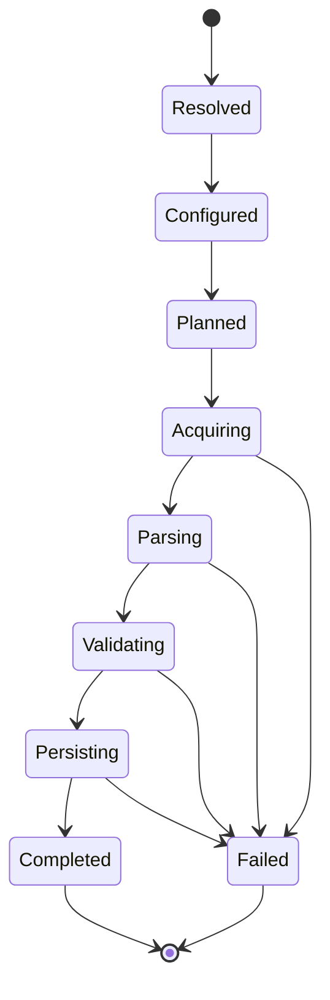
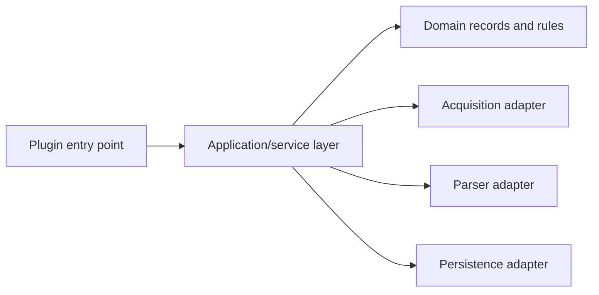

# Dataset Plugin Architecture

## 1. Purpose

The plugin architecture separates reusable application infrastructure from dataset-specific knowledge.

A plugin represents one logical dataset family. For example:

```text
--plugin ofgem
```

The plugin identifier is stable, lower-case, and suitable for command-line use.

## 2. Contract

The initial public contract should remain intentionally small.

```java
package com.towermarsh.opendata.plugin;

public interface DatasetPlugin {

    PluginDescriptor descriptor();

    ConfigurationSchema configurationSchema();

    RunReport execute(PluginExecutionContext context);
}
```

The plugin receives services through `PluginExecutionContext`, not through global singletons.

## 3. Execution context

A context should provide:

- `RunId`.
- Validated immutable `PluginConfiguration`.
- `DownloadService`.
- `SourceFileStore`.
- `ChecksumService`.
- `TransactionManager`.
- `RunMetadataRepository`.
- `Clock`.
- JUL `Logger` or an approved logger factory.
- Dry-run flag.

It must not provide:

- Raw CLI arguments.
- Mutable global configuration.
- Undocumented database connections.
- Environment-specific static state.

## 4. Plugin descriptor

A descriptor should contain:

```text
id              ofgem
displayName     Ofgem Energy Price Cap
version         implementation version
description     concise user-facing description
defaultResource /plugins/ofgem/default.properties
capabilities    download, full-load, incremental-load
```

## 5. Registration

Two registration approaches are acceptable:

### Initial approach: explicit registration

The application composition root instantiates and registers known plugins.

Advantages:

- Simple.
- Easy to debug.
- No hidden classpath behaviour.
- Suitable while the project is one Maven module.

### Later option: `ServiceLoader`

Java `ServiceLoader` may be introduced when independently packaged plugins are required.

This change must be recorded in an ADR because it affects packaging and discovery.

## 6. Plugin lifecycle



## 7. Plugin layering

A plugin should use the following internal dependency direction:



Domain objects should not depend on JDBC, HTTP, CLI, or file APIs.

## 8. Plugin configuration

A plugin defines:

- Its default properties resource.
- Its configuration schema.
- Typed conversion rules.
- Cross-property validation.
- A safe configuration summary.

Example Ofgem properties:

```properties
source.url=https://example.invalid/ofgem/source.csv
source.connectTimeoutSeconds=30
source.readTimeoutSeconds=120
source.expectedContentType=text/csv

archive.directory=data/archive/ofgem
archive.retainSource=true
archive.checksumAlgorithm=SHA-256

database.batchSize=500
database.targetSchema=opendata
database.targetTable=ofgem_energy_price_cap

load.mode=MERGE
validation.failOnRejectedRecord=false
```

Real source URLs and database credentials should be supplied through the approved local configuration process.

## 9. Result contract

Every plugin returns a `RunReport` containing:

- Plugin ID.
- Run ID.
- Status.
- Start and finish timestamps.
- Source identity.
- Record counts.
- Warnings.
- Failure category and safe message when failed.

The core converts the report to a process exit code.

## 10. Isolation rules

A plugin must not:

- Call `System.exit`.
- Configure global JUL handlers.
- Read the raw command line.
- Depend on another concrete plugin.
- Write outside its approved archive path.
- Commit a transaction it did not create.
- Log credentials or full connection strings.
- Silently ignore malformed source data.
