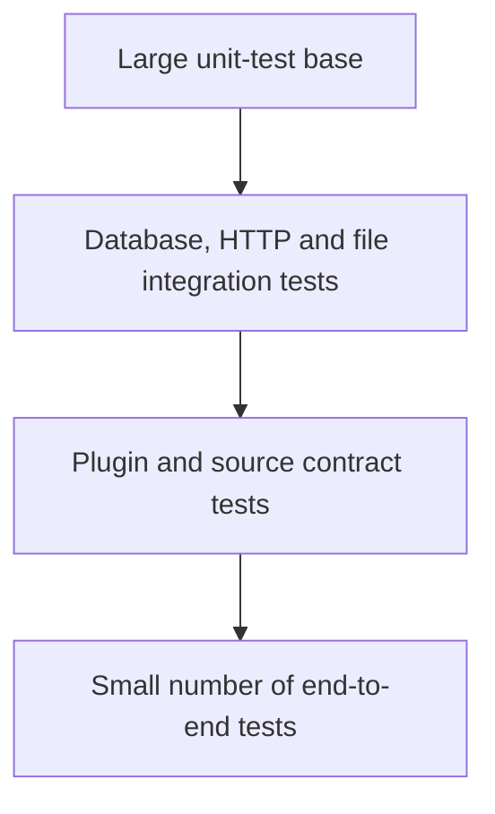

# Testing Architecture

## 1. Test pyramid



## 2. Unit tests

Unit tests cover:

- CLI option interpretation.
- Configuration merging.
- Type conversion.
- Configuration validation.
- Archive path construction.
- Checksum generation.
- Parser edge cases.
- Dataset validation rules.
- Mapping and rounding.
- Exit-code mapping.
- Run-report counts.

Tests should not require network or SQL Server.

## 3. Integration tests

Integration tests cover:

- SQL Server connection and transaction behaviour.
- Schema scripts.
- Batch inserts and updates.
- Rollback after failure.
- HTTP response handling through a local test server.
- Atomic file storage.
- JUL configuration loading.

Containerised SQL Server may be used where licensing and environment support are acceptable.

## 4. Plugin contract tests

Every plugin must pass a shared contract suite.

The suite should verify:

- Descriptor ID is valid and unique.
- Default resource exists.
- Configuration schema accepts defaults.
- Unknown keys are handled consistently.
- Dry run does not mutate the database.
- Run report contains required fields.
- Failure is reported without `System.exit`.
- No secret value is rendered.

## 5. Source-format tests

Plugins should include representative source fixtures:

```text
src/test/resources/plugins/ofgem/
├── valid-minimal.csv
├── valid-complete.csv
├── missing-column.csv
├── malformed-number.csv
├── duplicate-key.csv
└── empty.csv
```

Provider-format assumptions must be captured as tests.

## 6. End-to-end tests

An end-to-end test should:

1. Start with a clean test database.
2. Use a fixed local source fixture.
3. Execute the application through its public runner.
4. Verify run metadata.
5. Verify inserted records.
6. Re-run the same source.
7. Verify idempotency.
8. Introduce a changed record.
9. Verify update counts.

## 7. Architecture tests

Automated rules should verify:

- Core packages do not depend on concrete plugins.
- Production packages have `package-info.java`.
- No banned logging framework is referenced.
- `HttpClient` use is restricted to the download package.
- Direct JDBC connection creation is restricted to persistence.
- Classes named `*Plugin` implement the plugin contract.
- No `System.exit` outside the application entry point.

ArchUnit is a suitable optional library for these checks.

## 8. Test data rules

- Test fixtures must not contain real credentials.
- Fixtures should be small and understandable.
- Production downloads must not be required for normal unit tests.
- Dates and clocks should be injected.
- Random identifiers should be controllable in tests.
- Locale and timezone assumptions should be explicit.

## 9. Quality gates

A release build should require:

- All tests passing.
- No compilation warnings introduced without justification.
- Architecture tests passing.
- Database migration validation passing.
- Documentation links valid.
- Dependency vulnerability review completed.
