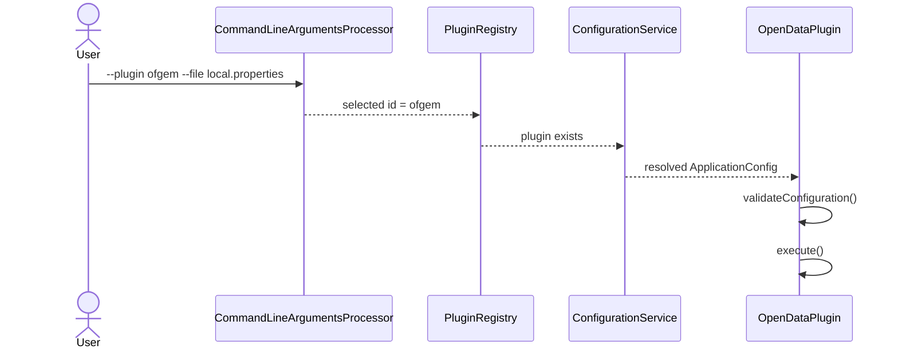

# Plugin Registry

**Document ID:** ARCH-PLUGIN-REGISTRY-001  
**Version:** 1.0  
**Status:** Draft  
**Last Updated:** 22 July 2026

## Purpose

This document defines how dataset plugins are discovered, registered, selected
and executed.

## Overview

The framework uses Java `ServiceLoader` as the initial plugin discovery
mechanism. This avoids hard-coded references from the core framework to
individual dataset implementations.

Each plugin implements:

```java
com.towermarsh.opendata.plugin.OpenDataPlugin
```

Each plugin JAR or application module declares its implementation in:

```text
META-INF/services/com.towermarsh.opendata.plugin.OpenDataPlugin
```

## Responsibilities

The plugin registry:

- discovers installed plugins;
- validates plugin identifiers;
- prevents duplicate identifiers;
- finds a plugin by id;
- returns an error when a requested plugin is absent;
- lists installed plugins for the command-line interface.

The registry does not:

- load plugin configuration;
- execute ETL steps directly;
- manage database connections;
- contain dataset-specific behaviour.

## Plugin Identifier Rules

A plugin identifier must:

- be non-null;
- be non-blank;
- be trimmed;
- be lowercase;
- remain stable across releases;
- uniquely identify one dataset plugin.

Example:

```text
ofgem
```

## Execution Flow



## ServiceLoader Registration

Example service declaration:

```text
com.towermarsh.opendata.plugin.ofgem.OfgemPlugin
```

One implementation class is placed on each line.

## Testing

Tests should create `ServiceLoaderPluginRegistry` from an explicit collection of
plugins. This avoids relying on classpath service discovery during unit tests.

Integration tests should separately verify that service declarations are
correctly packaged.

## Future Enhancements

Potential future enhancements include:

- plugin version metadata;
- plugin capability metadata;
- disabled-plugin configuration;
- dependency compatibility checks;
- isolated plugin class loaders;
- externally installed plugin JARs;
- signed plugin packages.

## Related Documents

- `007-plugin-architecture.md`
- `011-configuration.md`
- `../reference/command-line-reference.md`
- `../reference/configuration-reference.md`
