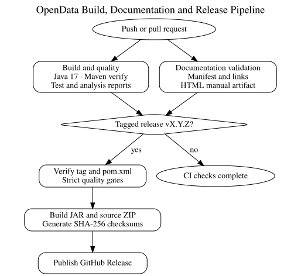

# Build, CI and Release Guide

**Document ID:** DEV-BUILD-001  
**Version:** 2.0  
**Status:** Version 2.0.0 baseline  
**Baseline date:** 2 August 2026

---

OpenData uses Maven and repository automation to apply repeatable build, test,
quality, documentation and release checks.



## Local verification

```powershell
mvn clean verify
.\scripts\Validate-Documentation.ps1 -FailOnWarning
```

For strict quality enforcement:

```powershell
mvn clean verify -Dquality.failOnViolation=true
```

Where SQL Server is available, also verify schema installation, configuration
registration, encrypted-password restart, dry runs, write runs and transaction
rollback behaviour.

## Continuous integration

The GitHub workflows compile and test the project, execute configured quality
tools, validate documentation and build documentation outputs. Environment-bound
SQL Server and live-provider acceptance tests remain release-operator checks
unless a suitable secured CI service is configured.

## Version 2.0.0 release preparation

A release tag must use `vMAJOR.MINOR.PATCH`, and the numeric part must match
`pom.xml`, release notes, runtime configuration and generated documentation.
Prepare a local package with:

```powershell
.\scripts\New-ReleasePackage.ps1 -Version 2.0.0
```

Before tagging:

1. complete the [final release checklist](../release/Final-Release-Checklist.md);
2. update `CHANGELOG.md` and `RELEASE_NOTES.md` with the actual release date;
3. confirm the working tree is clean;
4. retain dependency, database, certificate and acceptance-test evidence; and
5. verify that no credentials, private keys or customer statements are included
   in release artefacts.

The current Maven JAR is not a self-contained executable. Do not describe it as
one in a public release unless packaging is changed and independently verified.
