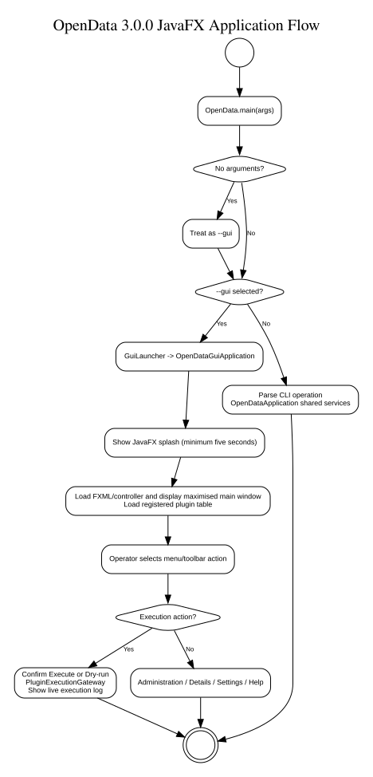
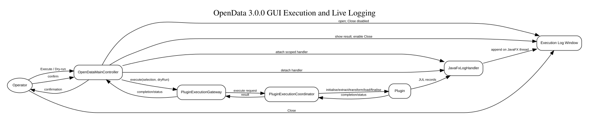

# JavaFX GUI Architecture

**Document ID:** DEV-GUI-001  
**Version:** 3.0.0  
**Status:** Implemented Version 3.0.0 baseline  
**Baseline date:** 15 August 2026  
**Minimum Java version:** 24

---

## Purpose

The OpenData graphical interface is a JavaFX presentation layer over the existing
configuration, registry, execution, logging and plugin services. It must not
reimplement SQL, plugin selection or ETL business logic in controllers.

## Runtime baseline

Version 3.0.0 requires Java 24 or later. The current development environment is:

- JDK 26;
- Apache NetBeans 31; and
- JavaFX 26.0.1.

Maven compiles with `release=24` and the Enforcer rule accepts Java 24 or later.
Development on JDK 26 must therefore avoid relying on APIs unavailable to the
Java 24 release target.

## Startup and lifecycle

The supported GUI startup path is:

```text
OpenData.main
        |
        v
com.towermarsh.opendata.gui.GuiLauncher
        |
        v
Application.launch(OpenDataGuiApplication.class, ...)
        |
        v
OpenDataSplashScreen
        |
        v
OpenDataMainView.fxml / OpenDataMainController
```

`OpenData.main` starts the GUI when no command-line arguments are supplied or
when `--gui`/`-g` is requested. Logging is initialised before JavaFX starts.
`Application.launch(...)` returns only after the JavaFX application exits, so the
main application `finally` block retains ownership of final status logging and
logging shutdown.

`OpenDataSplashScreen` is JavaFX-only and keeps the splash visible for a minimum
of five seconds without sleeping on the JavaFX application thread. The main
stage is configured while the splash is visible and then shown maximised.

The obsolete Swing presentation package is not part of the merged Version 3.0.0
source tree.



## Main presentation components

| Component | Responsibility |
|---|---|
| `OpenDataGuiApplication` | JavaFX lifecycle, FXML loading, main stage and application icon |
| `OpenDataMainView.fxml` | Declarative main-window menus, toolbar, plugin table and status bar |
| `OpenDataMainController` | Presentation event wiring, selection snapshots, task lifecycle and view updates |
| `PluginRow` | JavaFX table presentation model |
| `OpenDataDialogs` | Reusable confirmations/warnings used by main-window actions |
| `OpenDataInformationDialogs` | Read-only property/value, text, About and fallback Help presentation |
| `OpenDataExecutionWindow` | Modal live Execute/Dry-run log window |
| `JavaFxLogHandler` | Batches scoped JUL output onto the JavaFX application thread |
| `OpenDataHelpLauncher` | Starts compiled Windows CHM Help when available and falls back to JavaFX Help |

The FXML and CSS resources remain Scene Builder-editable and are kept under
`src/main/resources/com/towermarsh/opendata/gui`.

## Controller/service boundary

The dependency direction is:

```text
JavaFX FXML / controls
        |
OpenDataMainController
        |
GUI gateways / loaders / presentation services
        |
existing OpenData application services
        |
configuration, registry, execution, logging, database and plugins
```

Blocking configuration and SQL Server work runs through JavaFX `Task` workers.
Only view/model changes execute on the JavaFX application thread.

## Plugin table loading

The main table is loaded through:

```text
OpenDataMainController
        |
        | JavaFX Task
        v
PluginTableDataLoader
        |
        +--> JdbcPluginRegistry
        |
        +--> PluginTableDataService --> latest core.PluginRun state
        |
        v
PluginTableEntry
        |
        v
PluginRow
```

`PluginTableDataLoader` owns the short-lived bootstrap/database resources needed
for the read. The controller receives plain `PluginTableEntry` records and maps
them to JavaFX properties only after the worker completes.

## Plugin administration

`PluginAdministrationGateway` owns the database resources used by Register,
Register from File, Enable, Disable and Unregister.

The normal Register action uses `PluginConfigurationDirectoryScanner` to inspect
`config/plugins` and the source-tree fallback
`src/main/resources/config/plugins`. Candidate definitions are validated before
being shown to the user. Already registered ids are filtered from the discovery
result.

Register from File uses JavaFX `FileChooser`, validates the selected definition
and passes the registration through the same framework registration contracts.
State-changing operations use a selection snapshot and confirmation before the
worker starts.

## Information dialogs

`PluginDetailGateway` reads one registered plugin's stored configuration.
`ApplicationSettingsGateway` resolves effective read-only application settings.
Both return `ConfigurationDisplayEntry` values rather than exposing JDBC or raw
configuration structures to the controller.

`ConfigurationDisplayMasker` masks explicitly sensitive properties and common
credential-bearing names before presentation. The Settings dialog does not
return a decrypted database password to the UI layer.

`LogViewerService` flushes the active JUL handlers and reads the current rotating
log without closing the logging subsystem.

## Execute and Dry-run boundary

The GUI execution path is:

```text
OpenDataMainController
        |
        | checked plugin-id snapshot + confirmation
        | JavaFX Task
        v
PluginExecutionGateway
        |
        +--> PluginSelectionResolver
        +--> PropertiesPluginDefinitionLoader
        +--> PluginExecutionCoordinator
        +--> normal database resource OR dry-run unavailable resource
```

Normal Execute and Dry-run are separate GUI actions. `PluginExecutionGateway`
uses the same registry/configuration and coordinator contracts as the CLI rather
than constructing a second execution engine.

During a run, `JavaFxLogHandler` is attached for the scoped execution window. It
formats and batches JUL text, then uses `Platform.runLater()` for safe UI
updates. Normal console/file handlers remain active. The handler is detached
when the scoped execution completes.

`OpenDataExecutionWindow` is modal. Its Close action and window-close request are
blocked while processing is active. Completion/failure updates the window and
enables Close. The main table is refreshed after the run so persisted status and
last-run date are visible.



## Help integration

`OpenDataHelpLauncher` checks supported locations for
`OpenData-Technical-User-Guide.chm`. On Windows it starts the file using
`hh.exe`. If the file is absent or cannot be started, the built-in JavaFX help
viewer is used instead. Help-launch failure is therefore non-fatal to the main
GUI.

A packaged image is expected to place the CHM below an `app/help` location near
the application JAR; source-tree execution also checks the generated Technical
User Guide Help output.

## Principal diagrams

The Version 3.0.0 diagram set includes:

- `component-architecture.puml` — application, GUI, registry/runtime and provider
  components;
- `package-dependencies.puml` — principal package dependency direction;
- `system-context.puml` — operator interaction through GUI or CLI;
- `gui-application-flow.puml` — GUI startup and action/service boundary; and
- `gui-execution-sequence.puml` — Execute/Dry-run confirmation, background
  execution, live logging and table refresh.

Render the PlantUML sources to `docs/diagrams/generated` before the final manual
build.

## Testing and release acceptance

The release candidate should be tested on JDK 24 (minimum contract) and may also
be exercised on the JDK 26 development environment. GUI acceptance covers:

- startup/no-argument routing;
- plugin-table loading and selection;
- registration and state changes;
- Plugin Detail and Settings masking;
- existing-log viewing;
- Execute and Dry-run background execution;
- live-log Close gating;
- CHM Help and JavaFX fallback; and
- clean JavaFX shutdown.

Use [GUI 3.0 final acceptance checklist](gui-v3.0-final-acceptance-checklist.md)
and the [GUI screenshot plan](gui-screenshot-plan.md) for release evidence.
