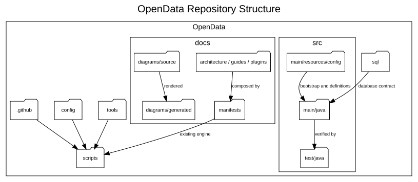

# Repository Structure

**Document ID:** DEV-REPOSITORY-001  
**Version:** 2.0  
**Status:** Version 2.0.0 baseline  
**Baseline date:** 2 August 2026

---



## Top-level layout

| Path | Purpose |
|---|---|
| `src/main/java` | Application, infrastructure and plugin source code |
| `src/main/resources/config` | Bootstrap properties, plugin registration definitions and development certificate resources |
| `src/test/java` | Unit and integration-oriented test source |
| `sql` | Ordered SQL Server installation, schema, permissions and verification scripts |
| `docs` | Authoritative Markdown, PlantUML, manifests and documentation assets |
| `config` | Documentation and code-quality configuration |
| `scripts` | Existing build, documentation, certificate and release automation |
| `.github` | GitHub Actions and repository automation |
| `tools` | Local tool placement guidance; third-party binaries are not committed by default |

## Java package layout

Reusable framework packages sit directly under
`com.towermarsh.opendata`, including:

```text
app
cli
config
database
discovery
download
etl
exception
logging
model
parser
plugin
validation
```

Source-specific code belongs under:

```text
com.towermarsh.opendata.plugin.<plugin-id>
```

Each plugin uses:

```text
initialise
extract
transform
load
finalise
```

Additional transform subpackages such as `model` and `validate` are permitted.
The shared `exception` package owns the exception hierarchy; plugins do not create
separate exception packages.

## Documentation layout

Canonical diagram sources are stored in `docs/diagrams/source`; rendered SVGs
are stored in `docs/diagrams/generated`. Generated manuals belong under the
configured documentation build directory and are not authoritative source.

Version 1.0.0 release records and implementation notes remain in the repository
as history. Current operational documents identify Version 2.0.0.
