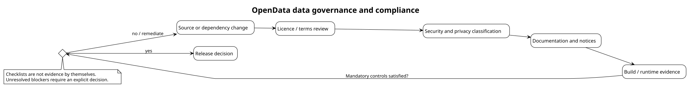

# Governance and Compliance

This section defines the non-code controls required to distribute and operate
OpenData responsibly.

- [Data and privacy governance](data-and-privacy-governance.md)
- [Dependency and attribution management](dependency-and-attribution-management.md)
- [Release compliance checklist](release-compliance-checklist.md)
- [Licensing policy](../Licensing-Policy.md)
- [Security policy](../../SECURITY.md)
- [Third-party notices](../../THIRD-PARTY-NOTICES.md)
- [Data-source notices](../../DATA-SOURCE-NOTICES.md)

Governance evidence must describe what was actually reviewed and executed. A
checklist entry is not evidence unless it links to an output, log, review record
or explicit waiver.
