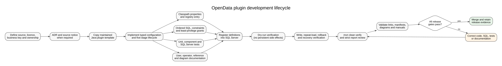

# Adding a Plugin

**Document ID:** GUIDE-PLUGIN-001
**Version:** 2.1
**Status:** Version 2.0.0 developer procedure
**Baseline date:** 4 August 2026
**Minimum Java version:** 24

---



## 1. Define the source and ownership

Before coding, record:

- publisher and dataset name;
- source URI and retrieval method;
- format, update frequency and expected volume;
- licence/terms and required attribution;
- stable business key and idempotency rule;
- target schema/tables;
- retention and archive requirements; and
- whether authentication or personal data is involved.

Update data-source notices and create an ADR for a durable new architectural
choice.

## 2. Copy the maintained template

Copy `docs/templates/plugin-java/.../example` to:

```text
src/main/java/com/towermarsh/opendata/plugin/<id>
```

Rename the package and every `Example` symbol. The stable plugin ID uses
lowercase letters, digits and hyphens at the CLI/resource boundary; Java package
names must remain valid lowercase identifiers.

The root class implements `OpenDataPlugin` and has a public
`PluginDefinition` constructor. `ReflectionPluginFactory` uses that constructor
before falling back to a no-argument constructor.

## 3. Implement the lifecycle stages

| Stage | Required outcome |
|---|---|
| `initialise` | Build typed configuration and orchestrate all stages |
| `extract` | Obtain and decode the provider source |
| `transform` | Produce immutable domain records |
| `transform.validate` | Reject invalid response or record sets |
| `load` | Own provider SQL, idempotency and accurate load counts |
| `finalise` | Cleanup/archive/report without hiding primary failures |

Dry run must stop before load and before archive or other persistent side
effects.

## 4. Use shared typed configuration

Construct `PluginPropertyValues` inside the typed configuration factory. Do not
copy parsing helpers from another plugin.

```java
final var properties = new PluginPropertyValues(definition);
final Duration timeout = ValidationRules.requirePositive(
        properties.duration("download.request-timeout", Duration.ofSeconds(60)),
        "download.request-timeout");
```

Use:

- `PluginPropertyValues` for strings, numbers, booleans, durations, dates, paths,
  URIs and caller-defined types;
- `ValidationRules` for lengths, positive values, ranges and date ordering;
- `SqlIdentifiers` only for configurable schema/table identifiers that must be
  composed into SQL.

Conversion error messages must not expose property values. Apply domain
validation after conversion.

## 5. Add classpath registration properties

Create:

```text
src/main/resources/config/plugins/<id>.properties
```

Add the ID to:

```text
src/main/resources/config/plugins/index.properties
```

The descriptor includes `plugin.*`, `dataset.id`, one or more
`endpoint.<name>.*` groups and typed `property.<name>.*` groups. Classpath
properties are the registration source; `--register` writes them to SQL Server,
and ordinary runs resolve plugin configuration from the database.

For JavaFX development, the **Register** command scans this source-tree plugin
folder directly for new `.properties` definitions. A packaged/deployed GUI also
checks `<working directory>/config/plugins` first. The classpath
`index.properties` file is still required for CLI packaged registration, but the
GUI scanner ignores it because it is not a complete plugin definition.

Do not add provider selection code to the application main class.

## 6. Select the persistence strategy

Provider SQL remains in `plugin.<id>.load`; shared JDBC classes provide the
mechanics.

| Data pattern | Use |
|---|---|
| Simple insert batches | `JdbcTransactionTemplate` plus `JdbcBatchExecutor` |
| Natural-key row upserts | typed `JdbcUpsertAdapter` plus `JdbcUpsertExecutor` |
| Larger staged loads | transaction template, batch staging and provider set-based SQL |
| Period/snapshot replacement | transaction template with explicit provider replacement SQL |

Example transaction:

```java
return new JdbcTransactionTemplate(database).execute(
        "Unable to persist example data",
        connection -> persist(connection, records));
```

The plugin retains schema names, SQL, bindings, natural keys, lock strategy,
provenance and result semantics. Do not create a universal repository or use
reflection to generate SQL.

When temporary tables or `SET` options can survive a pooled logical connection,
provide `JdbcConnectionCleanup` to restore the session after success or failure.

## 7. Add SQL

Use ordered, idempotent SQL scripts for schema, tables, constraints, indexes,
permissions and verification. The application principal receives only required
rights. Prepared statements remain mandatory for values. Validate configured SQL
identifiers before composing schema or table names.

## 8. Apply API lifecycle metadata

Every new or materially changed public API for this release uses:

```java
@since 2.0.0
```

When an obsolete public procedure must remain temporarily, add both Java
`@Deprecated` and Javadoc `@deprecated`, and name the replacement. Remove private
obsolete helpers when they have no external callers instead of preserving dead
wrappers.

## 9. Test

At minimum cover:

- required/default/invalid typed configuration;
- domain ranges and date ordering;
- endpoint construction and extraction failures;
- representative and malformed source fixtures;
- transformation and cross-record validation;
- dry-run absence of database and archive side effects;
- transaction commit, rollback and auto-commit restoration;
- configured batch boundaries or upsert insert/update branches;
- pooled-session cleanup where connection-local state is used;
- repeat load, accurate metrics and SQL Server permissions;
- registry loading and reflection construction; and
- deprecation annotations for any retained compatibility API.

Mock JDBC tests are not SQL Server integration tests.

## 10. Document and register

Add:

- plugin overview;
- operator/user chapter;
- configuration and schema reference;
- source-to-column mapping or data dictionary;
- failure/recovery notes;
- architecture/sequence and data-model diagrams;
- source notice and third-party notice changes; and
- ADR status updates.

Update the relevant generated-document manifests so new material is included in
the delivered manuals. Run documentation validation, diagram rendering,
`mvn clean verify`, strict quality review and the release acceptance matrix.

See [Shared Validation and JDBC Reference](../reference/shared-validation-and-jdbc-reference.md).
