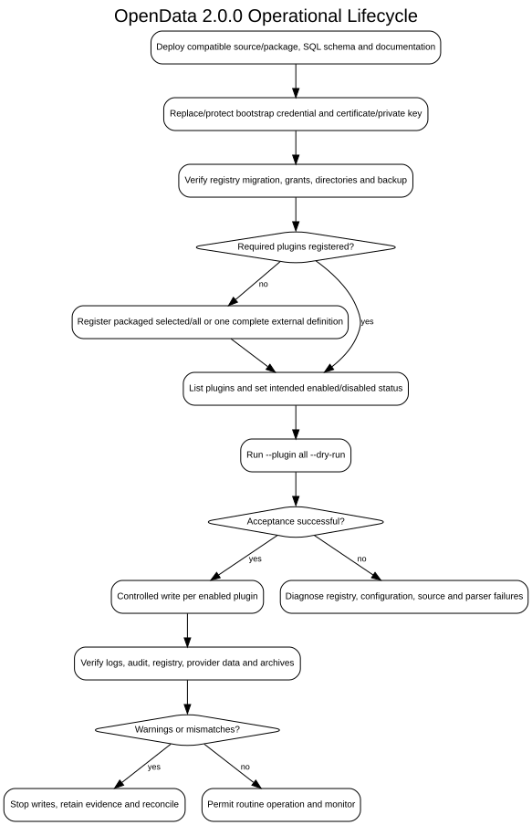

# Operations Documentation

**Document ID:** OPS-INDEX-001  
**Version:** 3.0.0  
**Status:** Version 3.0.0 operational baseline  
**Baseline date:** 15 August 2026  

---

- [Operations runbook](operations-runbook.md)
- [Monitoring and diagnostics](monitoring-and-diagnostics.md)
- [Backup and recovery](backup-and-recovery.md)
- [Logging and connection-pool operations](logging-and-pool.md)
- [Database troubleshooting](../guides/database-troubleshooting.md)

The operational lifecycle is summarised below.

Internal scheduling is deferred. External scheduling should remain disabled for
production use until packaging and operating-system exit-code propagation are
implemented or the scheduler has a tested log-based success check.
