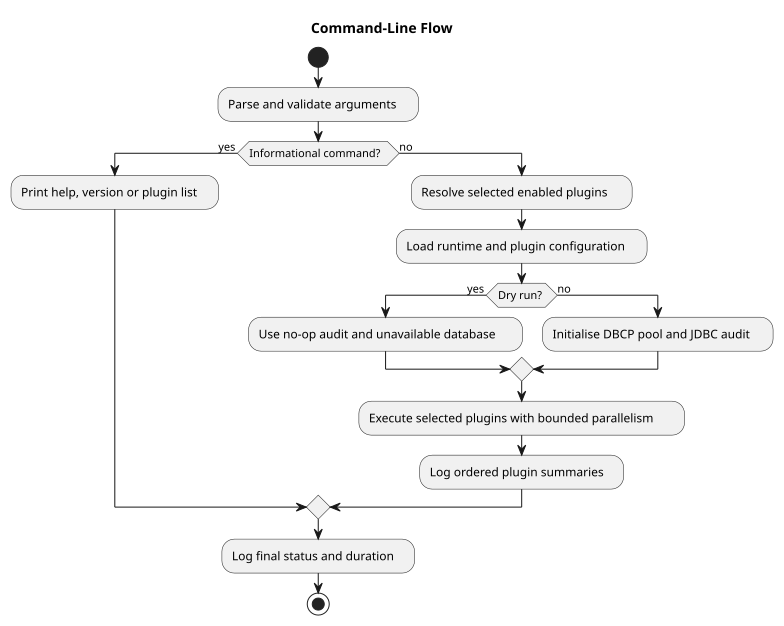

# Command-Line Reference

**Document ID:** REF-CLI-001  
**Version:** 2.0  
**Status:** Implemented  
**Baseline date:** 24 July 2026  
**Minimum Java version:** 17

## Syntax

```text
opendata --plugin <id|all> [--plugin <id>] [--file <override.properties>] [options]
```

| Option | Purpose |
|---|---|
| `-p`, `--plugin <id|all>` | Select one plugin, repeat the option, use comma-separated ids, or select all enabled plugins |
| `-f`, `--file <path>` | Apply application and plugin overrides for this invocation |
| `-j`, `--parallelism <1-64>` | Bound concurrently executing plugin tasks |
| `--dry-run` | Execute acquisition and validation without database pool creation, audit rows or plugin writes |
| `-v`, `--verbose` | Enable `FINE` `java.util.logging` output |
| `-h`, `--help` | Display usage help |
| `--version` | Display the application version |
| `--list-plugins` | List installed plugin descriptors |

`--plugin` is required for an execution request but not for informational commands. `--file` requires a plugin selection. Duplicate ids are rejected, and `all` cannot be combined with named ids.

Examples:

```text
opendata --plugin openmeteo
opendata --plugin openmeteo --parallelism 1
# Repeated/comma-separated ids are supported when multiple executable plugins are installed.
opendata --plugin all --dry-run
```

The actual worker count is the lower of selected plugin count and effective parallelism. Application-level errors are represented by `ExecutionStatus`; lower layers do not call `System.exit`.


