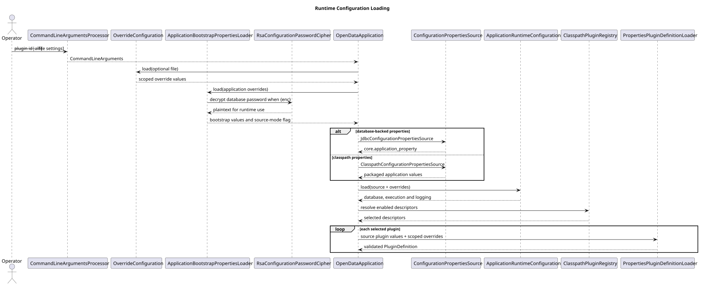

# Configuration Reference

**Document ID:** REF-CONFIG-001  
**Version:** 2.0  
**Status:** Implemented runtime path with legacy compatibility classes  
**Baseline date:** 24 July 2026  
**Minimum Java version:** 17

## Maintained runtime files

```text
src/main/resources/config/application.properties
src/main/resources/config/plugins/index.properties
src/main/resources/config/plugins/<plugin-id>.properties
```

`application.properties` resolves `ApplicationRuntimeConfiguration`, including `ExecutionConfiguration`, `DatabasePoolConfiguration` and `LoggingConfiguration`. The explicit plugin index resolves `PluginDescriptor` values. `PropertiesPluginDefinitionLoader` combines each descriptor file with invocation overrides to produce an immutable `PluginDefinition`.

## Override precedence

For the active command-line runtime, later values override earlier values:

1. classpath `config/application.properties`;
2. classpath plugin properties;
3. application and plugin entries in the optional `--file` override.

Application overrides use the `application.` prefix. A single-plugin run may use unscoped plugin keys. A multi-plugin or `all` run must use `plugin.<id>.` prefixes to prevent accidental cross-plugin overrides.

```properties
application.database.password=secret
application.execution.max-parallel-plugins=4
plugin.openmeteo.property.start-date.value=2025-01-01
```

Blank database passwords are rejected for database-writing runs. Dry runs do not initialise the pool and therefore may omit the password.

## Transitional classes

`ApplicationConfig`, `ApplicationConfigurationService`, `ConfigurationLoader` and the duplicate `com.towermarsh.opendata.app.CommandLineArguments` belong to an earlier single-plugin configuration path. They should not be used as the reference for the current multi-plugin runtime and are candidates for removal after compatibility requirements are confirmed.


