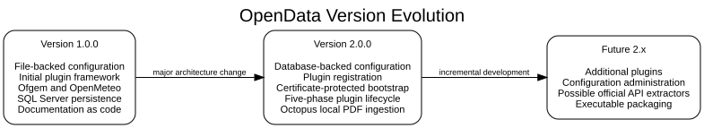

# OpenData 2.0.0 Release Record

**Release status:** Development and release-candidate baseline  
**Documentation baseline:** 2 August 2026  
**Release date:** To be assigned after acceptance  
**Licence:** Apache License 2.0

## Summary

OpenData 2.0.0 establishes database-backed configuration, certificate-protected
bootstrap credentials and a consistent five-phase plugin lifecycle. It also
promotes the Octopus Energy integration from a transform-only implementation to
a local-file ingestion workflow with duplicate prevention, transactional loading
and post-commit archiving.

## Delivered capabilities

- Minimal bootstrap configuration and SQL Server runtime configuration.
- Registration of installed application and plugin properties.
- RSA OAEP encryption and decryption of the database password.
- Source-tree and classpath certificate lookup.
- Ofgem and OpenMeteo plugins aligned with the common plugin lifecycle.
- Octopus local PDF discovery, SHA-256 ledger, batch transform and transactional
  persistence.
- Side-effect-free dry-run behaviour and bounded parallel plugin execution.
- Manifest-driven documentation for multiple generated manuals.

## Compatibility and migration

Version 2.0.0 changes configuration ownership and the expected internal plugin
package structure. Existing Version 1.x installations must install the new schema,
prepare certificates, register configuration and migrate custom plugins. See
[Upgrade from Version 1.x](../migration/version-1-to-version-2.md).

## Not included

- Direct Octopus Energy website or API statement download.
- Internal scheduling.
- Graphical administration of database configuration.
- A self-contained executable JAR.
- An enterprise secret-management service.

These omissions should not be described as implemented Version 2.0.0 features.

## Acceptance status

Use [Final-Release-Checklist.md](Final-Release-Checklist.md) to record the clean
build, documentation, database, registration, plugin and security evidence before
assigning a release date and publishing tag `v2.0.0`.
