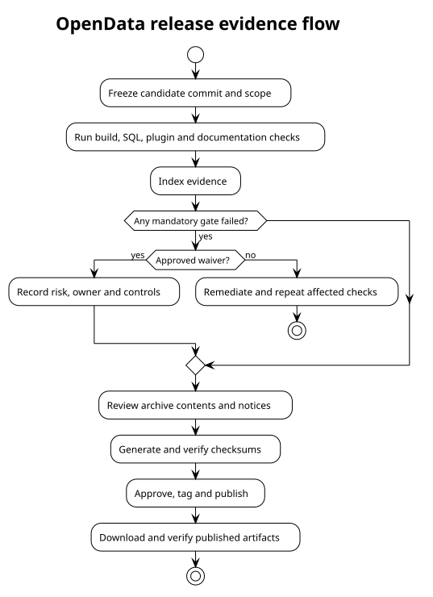

# Release Process

## 1. Freeze scope

Identify the candidate commit, version, included plugins, database schema and
documentation baseline. Stop adding unrelated features.

## 2. Build evidence

Run clean Java build/quality/tests, SQL installation and integration acceptance,
configuration registration/restart, plugin tests and documentation generation.
Store outputs outside source archives and reference them from the evidence index.

## 3. Resolve blockers

A failed mandatory gate is not converted to a pass by describing it. Fix the
issue or record a formal waiver containing risk, owner, compensating controls and
review/expiry date.

## 4. Package

Create source, documentation and intended runtime archives from the release
commit. Review archive contents for secrets, private data, unwanted generated
files, missing notices and launch dependencies. Generate checksums last.

## 5. Approve and publish

Complete the final checklist, update release status/date, create an annotated tag
and publish matching release notes/artifacts. Do not rebuild different bytes under
the same checksum or tag.

## 6. Verify after publication

Download the published artifacts, verify checksums, inspect notices, test the
documented launch path and confirm links. Record any release incident and avoid
silently replacing published artifacts.

